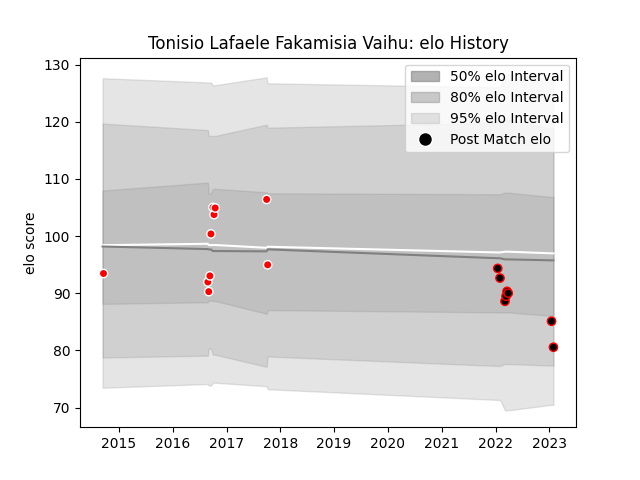

---  
layout: page  
title: Tonisio Lafaele Fakamisia Vaihu  
date: 2023-01-17 11:46:37.225790  
categories: player  
---
# Tonisio Lafaele Fakamisia Vaihu

## Positions: C

## Current elo: 85.0

## Current Percentile: 30.0

# Elo History

# Match History

| Team                            |   Appearances |   Win Rate |
|:--------------------------------|--------------:|-----------:|
| Kobelco Kobe Steelers           |            10 |   0.8      |
| NTT Docomo Red Hurricanes Osaka |             7 |   0.285714 |

| Opponent                          |   Matches |   Win Rate |
|:----------------------------------|----------:|-----------:|
| Yokohama Canon Eagles             |         3 |   0.333333 |
| Saitama Wild Knights              |         2 |   0        |
| Shizuoka Blue Revs                |         2 |   0.5      |
| Black Rams Tokyo                  |         1 |   1        |
| Coca-Cola Red Sparks              |         1 |   1        |
| Green Rockets Tokatsu             |         1 |   1        |
| Kubota Spears Funabashi Tokyo-Bay |         1 |   0        |
| NTT Docomo Red Hurricanes Osaka   |         1 |   1        |
| Skyactivs Hiroshima               |         1 |   1        |
| Toshiba Brave Lupus Tokyo         |         1 |   0        |
| Toyota Industries Shuttles Aichi  |         1 |   1        |
| Toyota Verblitz                   |         1 |   1        |
| Urayasu D-Rocks                   |         1 |   1        |