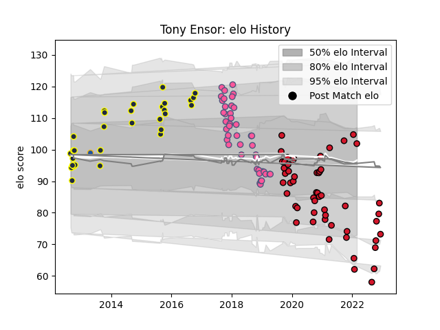

---  
layout: page  
title: Tony Ensor  
date: 2022-11-22 11:29:31.303709  
categories: player  
---
# Tony Ensor

## Positions: FB

## Current elo: 77.0

## Current Percentile: 3.0

# Elo History

# Match History

| Team                 |   Appearances |   Win Rate |
|:---------------------|--------------:|-----------:|
| Oyonnax              |            44 |   0.647727 |
| Stade Francais Paris |            42 |   0.428571 |
| Otago                |            27 |   0.62963  |
| Highlanders          |             1 |   0        |

| Opponent                   |   Matches |   Win Rate |
|:---------------------------|----------:|-----------:|
| Agen                       |         5 |   0.6      |
| Northland                  |         5 |   0.8      |
| Beziers                    |         4 |   1        |
| Biarritz Olympique         |         4 |   0.25     |
| Pau                        |         4 |   0.5      |
| Nevers                     |         4 |   1        |
| Lyon                       |         4 |   0        |
| Grenoble                   |         3 |   0.666667 |
| Vannes                     |         3 |   0.333333 |
| Soyaux-Angouleme           |         3 |   1        |
| Southland                  |         3 |   1        |
| Rouen                      |         3 |   0.333333 |
| Provence Rugby             |         3 |   0.833333 |
| Montpellier Herault        |         3 |   0.666667 |
| Montauban                  |         3 |   0.666667 |
| Auckland                   |         3 |   0.333333 |
| Mont-de-Marsan             |         3 |   0.833333 |
| Wellington                 |         3 |   0.333333 |
| Aurillac                   |         3 |   0.333333 |
| Bordeaux Begles            |         3 |   0.666667 |
| Colomiers                  |         3 |   0.166667 |
| Carcassonne                |         3 |   0.666667 |
| Oyonnax                    |         2 |   0.5      |
| Toulon                     |         2 |   0        |
| Tasman                     |         2 |   0.5      |
| Bay of Plenty              |         2 |   1        |
| Brive                      |         2 |   0.5      |
| Canterbury                 |         2 |   0        |
| Krasny Yar                 |         2 |   0.5      |
| Perpignan                  |         2 |   0.5      |
| Ospreys                    |         2 |   0.5      |
| Edinburgh                  |         2 |   0.5      |
| La Rochelle                |         2 |   0.5      |
| London Irish               |         2 |   0.5      |
| Manawatu                   |         2 |   1        |
| Clermont Auvergne          |         2 |   0        |
| Counties Manukau           |         1 |   0        |
| Roval Drome XV             |         1 |   1        |
| Crusaders                  |         1 |   0        |
| Castres Olympique          |         1 |   0        |
| Stade Toulousain           |         1 |   0        |
| Taranaki                   |         1 |   1        |
| Racing 92                  |         1 |   1        |
| Valence Romans Drome Rugby |         1 |   1        |
| North Harbour              |         1 |   1        |
| Waikato                    |         1 |   1        |
| Hawke's Bay                |         1 |   0        |