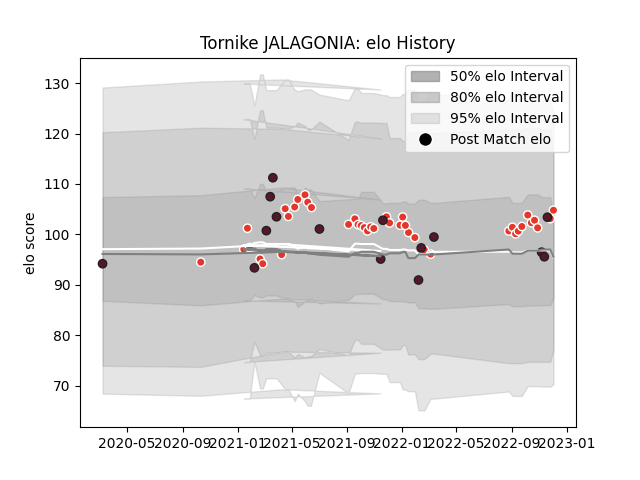

---  
layout: page  
title: Tornike JALAGONIA  
date: 2023-02-28 11:07:57.926644  
categories: player  
---
# Tornike JALAGONIA

## Positions: N8, FL

## Country: Georgia

## Current elo: 103.0

## Current Percentile: 66.0

# Elo History

# Match History

| Team               |   Appearances |   Win Rate |
|:-------------------|--------------:|-----------:|
| Biarritz Olympique |            41 |   0.463415 |
| Georgia            |            15 |   0.733333 |

| Opponent             |   Matches |   Win Rate |
|:---------------------|----------:|-----------:|
| Portugal             |         3 |   0.833333 |
| Vannes               |         3 |   0.666667 |
| Carcassonne          |         3 |   0.666667 |
| Perpignan            |         3 |   0        |
| Bordeaux Begles      |         2 |   0.5      |
| Brive                |         2 |   0.5      |
| Toulon               |         2 |   0        |
| Colomiers            |         2 |   1        |
| Stade Francais Paris |         2 |   0.5      |
| Romania              |         2 |   1        |
| Rouen                |         2 |   0.5      |
| Russia               |         2 |   1        |
| Mont-de-Marsan       |         2 |   0        |
| Montauban            |         2 |   1        |
| Samoa                |         1 |   0        |
| Racing 92            |         1 |   1        |
| Agen                 |         1 |   0        |
| South Africa         |         1 |   0        |
| Soyaux-Angouleme     |         1 |   1        |
| Provence Rugby       |         1 |   1        |
| Stade Toulousain     |         1 |   0        |
| Uruguay              |         1 |   1        |
| Spain                |         1 |   1        |
| Newcastle Falcons    |         1 |   0        |
| Oyonnax              |         1 |   1        |
| Aurillac             |         1 |   1        |
| Nevers               |         1 |   0.5      |
| Netherlands          |         1 |   1        |
| Montpellier Herault  |         1 |   0        |
| Lyon                 |         1 |   0        |
| La Rochelle          |         1 |   0        |
| Grenoble             |         1 |   1        |
| France               |         1 |   0        |
| Fiji                 |         1 |   0.5      |
| Clermont Auvergne    |         1 |   0        |
| Castres Olympique    |         1 |   0        |
| Bayonne              |         1 |   0.5      |
| Wales                |         1 |   1        |