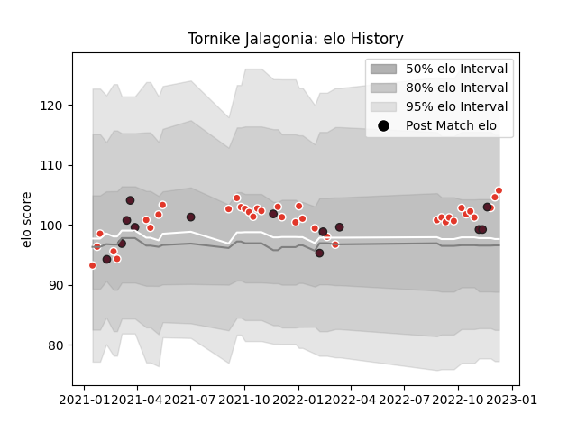

---  
layout: page  
title: Tornike Jalagonia  
date: 2022-12-09 13:10:55.449225  
categories: player  
---
# Tornike Jalagonia

## Positions: N8, FL

## Country: Georgia

## Current elo: 105.0

## Current Percentile: 73.0

# Elo History

# Match History

| Team               |   Appearances |   Win Rate |
|:-------------------|--------------:|-----------:|
| Biarritz Olympique |            36 |   0.472222 |
| Georgia            |            13 |   0.769231 |

| Opponent             |   Matches |   Win Rate |
|:---------------------|----------:|-----------:|
| Rouen                |         2 |       0.5  |
| Bordeaux Begles      |         2 |       0.5  |
| Brive                |         2 |       0.5  |
| Carcassonne          |         2 |       0.5  |
| Vannes               |         2 |       0.5  |
| Portugal             |         2 |       0.75 |
| Colomiers            |         2 |       1    |
| Toulon               |         2 |       0    |
| Grenoble             |         2 |       0.75 |
| Romania              |         2 |       1    |
| Stade Francais Paris |         2 |       0.5  |
| Mont-de-Marsan       |         2 |       0    |
| Montauban            |         2 |       1    |
| Russia               |         2 |       1    |
| South Africa         |         1 |       0    |
| Samoa                |         1 |       0    |
| Agen                 |         1 |       0    |
| Soyaux-Angouleme     |         1 |       1    |
| Spain                |         1 |       1    |
| Uruguay              |         1 |       1    |
| Stade Toulousain     |         1 |       0    |
| Oyonnax              |         1 |       1    |
| Racing 92            |         1 |       1    |
| Provence Rugby       |         1 |       1    |
| Perpignan            |         1 |       0    |
| Aurillac             |         1 |       1    |
| Nevers               |         1 |       0.5  |
| Netherlands          |         1 |       1    |
| Montpellier Herault  |         1 |       0    |
| Lyon                 |         1 |       0    |
| La Rochelle          |         1 |       0    |
| Fiji                 |         1 |       0.5  |
| Clermont Auvergne    |         1 |       0    |
| Castres Olympique    |         1 |       0    |
| Wales                |         1 |       1    |