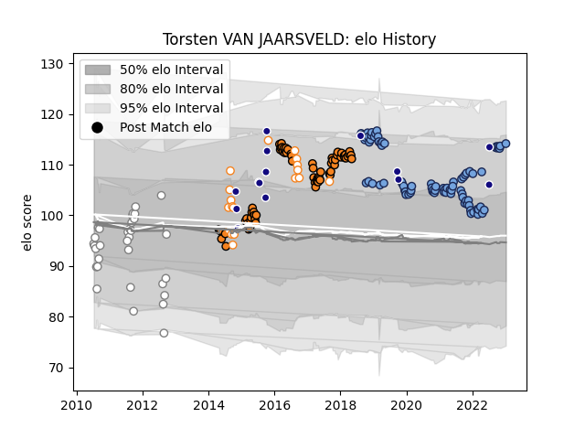

---  
layout: page  
title: Torsten VAN JAARSVELD  
date: 2023-01-19 11:52:54.329744  
categories: player  
---
# Torsten VAN JAARSVELD

## Positions: H

## Country: Namibia

## Current elo: 114.0

## Current Percentile: 87.0

# Elo History

# Match History

| Team                |   Appearances |   Win Rate |
|:--------------------|--------------:|-----------:|
| Bayonne             |            86 |   0.581395 |
| Cheetahs            |            71 |   0.366197 |
| Pumas               |            32 |   0.359375 |
| Free State Cheetahs |            18 |   0.583333 |
| Namibia             |            14 |   0.428571 |

| Opponent                 |   Matches |   Win Rate |
|:-------------------------|----------:|-----------:|
| Stormers                 |         7 |   0.285714 |
| Natal Sharks             |         7 |   0.214286 |
| Golden Lions             |         7 |   0.285714 |
| Bulls                    |         7 |   0.285714 |
| Western Province         |         6 |   0.166667 |
| Blue Bulls               |         6 |   0.333333 |
| Griquas                  |         6 |   0.666667 |
| Agen                     |         5 |   0.7      |
| Brive                    |         5 |   0.5      |
| Sharks                   |         5 |   0.4      |
| Leopards                 |         5 |   0.8      |
| Lions                    |         5 |   0        |
| Montauban                |         4 |   1        |
| Stade Toulousain         |         4 |   0.75     |
| Mont-de-Marsan           |         4 |   0.125    |
| Bordeaux Begles          |         4 |   0.25     |
| Stade Francais Paris     |         4 |   0.5      |
| Colomiers                |         4 |   0.75     |
| Sunwolves                |         4 |   1        |
| Aurillac                 |         4 |   0.75     |
| Vannes                   |         3 |   1        |
| Western Force            |         3 |   0.666667 |
| Southern Kings           |         3 |   1        |
| Beziers                  |         3 |   0.666667 |
| Scarlets                 |         3 |   0.333333 |
| Provence Rugby           |         3 |   0.333333 |
| Oyonnax                  |         3 |   0.666667 |
| Montpellier Herault      |         3 |   0.333333 |
| Lyon                     |         3 |   0        |
| Brumbies                 |         3 |   0.333333 |
| Carcassonne              |         3 |   0.666667 |
| Free State Cheetahs      |         3 |   0        |
| Eastern Province Kings   |         3 |   0.833333 |
| Glasgow Warriors         |         2 |   0        |
| Crusaders                |         2 |   0        |
| New Zealand              |         2 |   0        |
| Ospreys                  |         2 |   0.5      |
| Pumas                    |         2 |   0        |
| Queensland Reds          |         2 |   0        |
| Rouen                    |         2 |   1        |
| Russia                   |         2 |   1        |
| Connacht                 |         2 |   0.5      |
| Nevers                   |         2 |   0.75     |
| Soyaux-Angouleme         |         2 |   0.5      |
| Clermont Auvergne        |         2 |   0.5      |
| Chiefs                   |         2 |   0        |
| Benetton Treviso         |         2 |   0        |
| Toulon                   |         2 |   0.5      |
| US Bressane              |         2 |   1        |
| Cardiff Blues            |         2 |   0.5      |
| Zebre                    |         2 |   1        |
| New South Wales Waratahs |         2 |   0        |
| Zimbabwe                 |         2 |   1        |
| Biarritz Olympique       |         2 |   0        |
| Highlanders              |         2 |   0        |
| La Rochelle              |         2 |   0.5      |
| Massy                    |         2 |   1        |
| Blues                    |         2 |   0.5      |
| Border Bulldogs          |         2 |   1        |
| Munster                  |         2 |   0        |
| Canada                   |         1 |   0        |
| Boland Cavaliers         |         1 |   1        |
| Griffons                 |         1 |   1        |
| Ulster                   |         1 |   0        |
| Leinster                 |         1 |   1        |
| Italy                    |         1 |   0        |
| Tonga                    |         1 |   0        |
| Castres Olympique        |         1 |   0        |
| Jaguares                 |         1 |   0        |
| Kenya                    |         1 |   1        |
| Hurricanes               |         1 |   0        |
| Argentina                |         1 |   0        |
| Narbonne                 |         1 |   1        |
| Dragons                  |         1 |   1        |
| SWD Eagles               |         1 |   1        |
| London Irish             |         1 |   1        |
| Germany                  |         1 |   1        |
| Racing 92                |         1 |   1        |
| Melbourne Rebels         |         1 |   0        |
| Georgia                  |         1 |   0        |
| Portugal                 |         1 |   0        |
| Perpignan                |         1 |   1        |
| Pau                      |         1 |   0        |
| Grenoble                 |         1 |   1        |
| Edinburgh                |         1 |   1        |