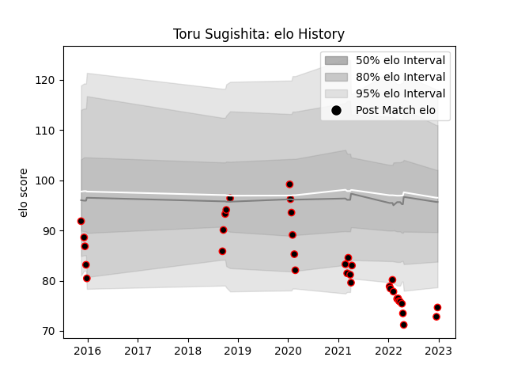

---  
layout: page  
title: Toru Sugishita  
date: 2023-02-02 19:02:39.147441  
categories: player  
---
# Toru Sugishita

## Positions: L, FL

## Current elo: 53.0

## Current Percentile: 0.0

# Elo History

# Match History

| Team                            |   Appearances |   Win Rate |
|:--------------------------------|--------------:|-----------:|
| NTT Docomo Red Hurricanes Osaka |            37 |   0.364865 |

| Opponent                          |   Matches |   Win Rate |
|:----------------------------------|----------:|-----------:|
| Shizuoka Blue Revs                |         4 |       0    |
| Toshiba Brave Lupus Tokyo         |         3 |       0    |
| Saitama Wild Knights              |         3 |       0    |
| Black Rams Tokyo                  |         2 |       0.5  |
| Kurita Water Gush                 |         2 |       0.5  |
| Toyota Verblitz                   |         2 |       0    |
| Tokyo Sungoliath                  |         2 |       0    |
| Mitsubishi Dynaboars              |         2 |       1    |
| Yokohama Canon Eagles             |         2 |       0.5  |
| Kobelco Kobe Steelers             |         2 |       0    |
| Green Rockets Tokatsu             |         2 |       0.75 |
| Kubota Spears Funabashi Tokyo-Bay |         1 |       0    |
| Kyuden Voltex                     |         1 |       1    |
| Chugoku Red Regulions             |         1 |       1    |
| Munakata Sanix Blues              |         1 |       0    |
| Kamaishi Seawaves                 |         1 |       1    |
| Hino Red Dolphins                 |         1 |       1    |
| Skyactivs Hiroshima               |         1 |       1    |
| Hanazono Kintetsu Liners          |         1 |       0    |
| Toyota Industries Shuttles Aichi  |         1 |       0    |
| Coca-Cola Red Sparks              |         1 |       1    |
| Mazda Blue Zoomers                |         1 |       1    |