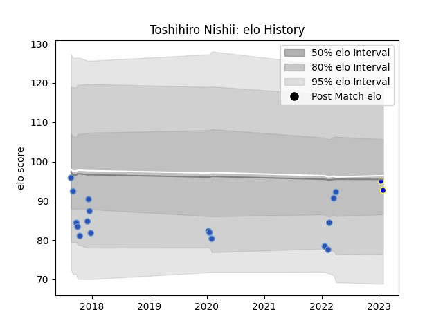

---  
layout: page  
title: Toshihiro Nishii  
date: 2023-01-17 11:44:43.428868  
categories: player  
---
# Toshihiro Nishii

## Positions: L

## Current elo: 95.0

## Current Percentile: 34.0

# Elo History

# Match History

| Team                 |   Appearances |   Win Rate |
|:---------------------|--------------:|-----------:|
| Munakata Sanix Blues |            17 |   0.352941 |
| Kamaishi Seawaves    |             1 |   1        |

| Opponent                          |   Matches |   Win Rate |
|:----------------------------------|----------:|-----------:|
| Shimizu Blue Sharks               |         3 |   0.666667 |
| Black Rams Tokyo                  |         2 |   0        |
| Green Rockets Tokatsu             |         2 |   0.5      |
| Kubota Spears Funabashi Tokyo-Bay |         2 |   0        |
| Chugoku Red Regulions             |         1 |   1        |
| Coca-Cola Red Sparks              |         1 |   1        |
| Hanazono Kintetsu Liners          |         1 |   0        |
| Kurita Water Gush                 |         1 |   1        |
| Kyuden Voltex                     |         1 |   1        |
| Saitama Wild Knights              |         1 |   0        |
| Shizuoka Blue Revs                |         1 |   0        |
| Toyota Industries Shuttles Aichi  |         1 |   0        |
| Yokohama Canon Eagles             |         1 |   0        |