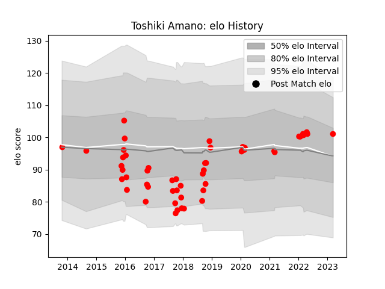

---  
layout: page  
title: Toshiki Amano  
date: 2023-03-21 18:36:10.929064  
categories: player  
---
# Toshiki Amano

Last updated: 2023-03-21
## Positions: SH

## Current elo: 101.0

## Current Percentile: None

# Elo History

# Match History

| Team                  |   Appearances |   Win Rate |
|:----------------------|--------------:|-----------:|
| Yokohama Canon Eagles |            51 |   0.441176 |

| Opponent                          |   Matches |   Win Rate |
|:----------------------------------|----------:|-----------:|
| Saitama Wild Knights              |         7 |   0        |
| Kobelco Kobe Steelers             |         5 |   0.2      |
| Green Rockets Tokatsu             |         4 |   0.75     |
| Toyota Industries Shuttles Aichi  |         4 |   1        |
| Coca-Cola Red Sparks              |         4 |   1        |
| Black Rams Tokyo                  |         3 |   0.333333 |
| Toyota Verblitz                   |         3 |   0.333333 |
| Toshiba Brave Lupus Tokyo         |         3 |   0.333333 |
| Shizuoka Blue Revs                |         3 |   0        |
| Urayasu D-Rocks                   |         3 |   0.333333 |
| NTT Docomo Red Hurricanes Osaka   |         2 |   0.5      |
| Tokyo Sungoliath                  |         2 |   0        |
| Mie Honda Heat                    |         2 |   0.25     |
| Kubota Spears Funabashi Tokyo-Bay |         2 |   0.5      |
| Munakata Sanix Blues              |         2 |   1        |
| Mitsubishi Dynaboars              |         1 |   1        |
| Hanazono Kintetsu Liners          |         1 |   1        |