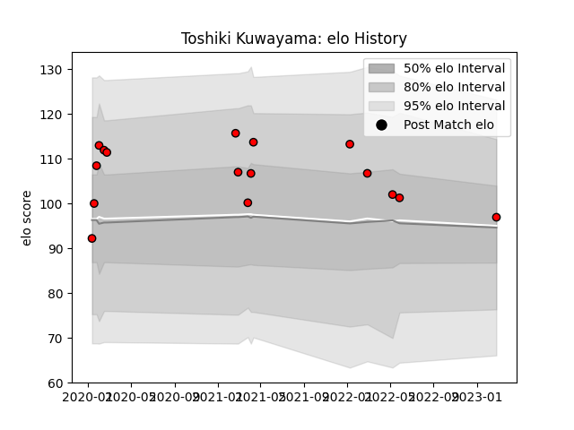

---  
layout: page  
title: Toshiki Kuwayama  
date: 2023-02-26 11:18:38.435601  
categories: player  
---
# Toshiki Kuwayama

## Positions: W, FB

## Current elo: 97.0

## Current Percentile: 67.0

# Elo History

# Match History

| Team                      |   Appearances |   Win Rate |
|:--------------------------|--------------:|-----------:|
| Toshiba Brave Lupus Tokyo |            16 |     0.4375 |

| Opponent                          |   Matches |   Win Rate |
|:----------------------------------|----------:|-----------:|
| Kubota Spears Funabashi Tokyo-Bay |         3 |        0   |
| Mie Honda Heat                    |         2 |        1   |
| Tokyo Sungoliath                  |         2 |        0.5 |
| Urayasu D-Rocks                   |         2 |        0   |
| Kobelco Kobe Steelers             |         1 |        0   |
| Mitsubishi Dynaboars              |         1 |        1   |
| Munakata Sanix Blues              |         1 |        1   |
| NTT Docomo Red Hurricanes Osaka   |         1 |        1   |
| Saitama Wild Knights              |         1 |        0   |
| Shizuoka Blue Revs                |         1 |        1   |
| Toyota Verblitz                   |         1 |        0   |