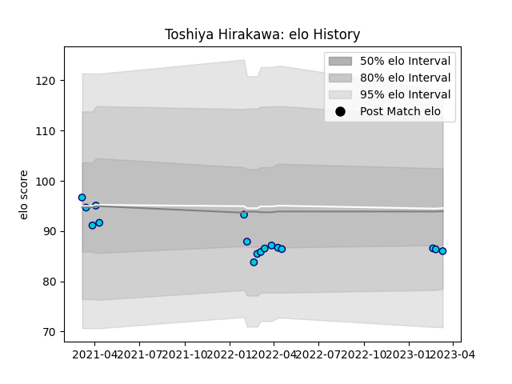

---  
layout: page  
title: Toshiya Hirakawa  
date: 2023-03-16 19:50:36.398324  
categories: player  
---
# Toshiya Hirakawa

## Positions: H

## Current elo: 86.0

## Current Percentile: None

# Elo History

# Match History

| Team               |   Appearances |   Win Rate |
|:-------------------|--------------:|-----------:|
| Shizuoka Blue Revs |            17 |   0.352941 |

| Opponent                          |   Matches |   Win Rate |
|:----------------------------------|----------:|-----------:|
| Green Rockets Tokatsu             |         2 |          1 |
| Kobelco Kobe Steelers             |         2 |          0 |
| Kubota Spears Funabashi Tokyo-Bay |         2 |          0 |
| NTT Docomo Red Hurricanes Osaka   |         2 |          1 |
| Saitama Wild Knights              |         2 |          0 |
| Tokyo Sungoliath                  |         2 |          0 |
| Yokohama Canon Eagles             |         2 |          0 |
| Black Rams Tokyo                  |         1 |          1 |
| Toshiba Brave Lupus Tokyo         |         1 |          0 |
| Urayasu D-Rocks                   |         1 |          1 |