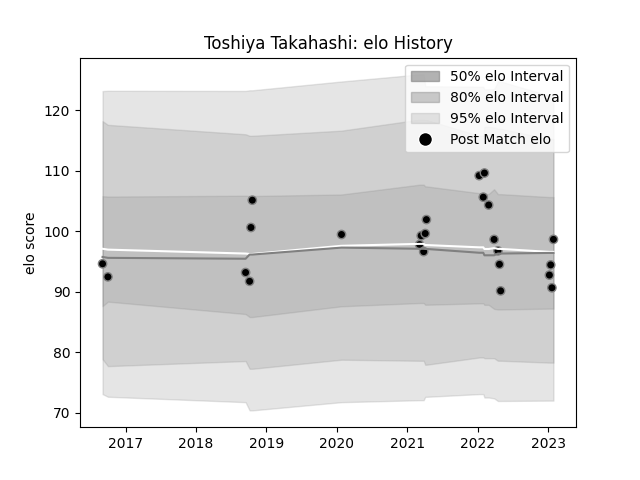

---  
layout: page  
title: Toshiya Takahashi  
date: 2023-02-02 18:42:25.932463  
categories: player  
---
# Toshiya Takahashi

## Positions: SH

## Current elo: 99.0

## Current Percentile: 32.0

# Elo History

# Match History

| Team             |   Appearances |   Win Rate |
|:-----------------|--------------:|-----------:|
| Black Rams Tokyo |            24 |   0.291667 |

| Opponent                          |   Matches |   Win Rate |
|:----------------------------------|----------:|-----------:|
| Shizuoka Blue Revs                |         4 |   0.25     |
| Toyota Verblitz                   |         3 |   0.333333 |
| Kubota Spears Funabashi Tokyo-Bay |         2 |   0        |
| NTT Docomo Red Hurricanes Osaka   |         2 |   0.5      |
| Saitama Wild Knights              |         2 |   0.5      |
| Tokyo Sungoliath                  |         2 |   0        |
| Urayasu D-Rocks                   |         2 |   0        |
| Yokohama Canon Eagles             |         2 |   0        |
| Coca-Cola Red Sparks              |         1 |   1        |
| Green Rockets Tokatsu             |         1 |   1        |
| Hino Red Dolphins                 |         1 |   1        |
| Kobelco Kobe Steelers             |         1 |   0        |
| Toshiba Brave Lupus Tokyo         |         1 |   0        |