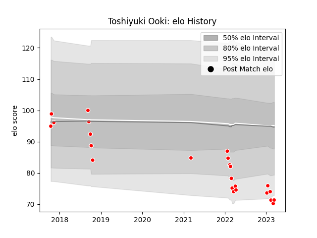

---  
layout: page  
title: Toshiyuki Ooki  
date: 2023-03-21 18:05:13.099595  
categories: player  
---
# Toshiyuki Ooki

Last updated: 2023-03-21
## Positions: P

## Current elo: 71.0

## Current Percentile: 4.0

# Elo History

# Match History

| Team                  |   Appearances |   Win Rate |
|:----------------------|--------------:|-----------:|
| Chugoku Red Regulions |            24 |  0.0833333 |

| Opponent                         |   Matches |   Win Rate |
|:---------------------------------|----------:|-----------:|
| Kurita Water Gush                |         5 |        0.4 |
| Kyuden Voltex                    |         4 |        0   |
| Kamaishi Seawaves                |         2 |        0   |
| Mitsubishi Dynaboars             |         2 |        0   |
| Munakata Sanix Blues             |         2 |        0   |
| Shimizu Blue Sharks              |         2 |        0   |
| Skyactivs Hiroshima              |         2 |        0   |
| Toyota Industries Shuttles Aichi |         2 |        0   |
| Hanazono Kintetsu Liners         |         1 |        0   |
| Mazda Blue Zoomers               |         1 |        0   |
| NTT Docomo Red Hurricanes Osaka  |         1 |        0   |