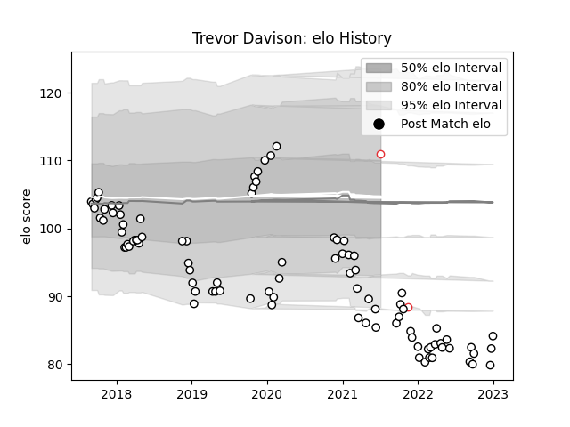

---  
layout: page  
title: Trevor Davison  
date: 2022-12-31 16:26:35.429294  
categories: player  
---
# Trevor Davison

## Positions: P

## Country: England

## Current elo: 102.0

## Current Percentile: 1.0

# Elo History

# Match History

| Team              |   Appearances |   Win Rate |
|:------------------|--------------:|-----------:|
| Newcastle Falcons |            93 |   0.478495 |
| England           |             2 |   1        |

| Opponent                 |   Matches |   Win Rate |
|:-------------------------|----------:|-----------:|
| Harlequins               |         8 |   0.25     |
| Gloucester Rugby         |         8 |   0.375    |
| Bath Rugby               |         7 |   0.428571 |
| Worcester Warriors       |         6 |   0.583333 |
| Wasps                    |         6 |   0.5      |
| Leicester Tigers         |         6 |   0.166667 |
| Sale Sharks              |         6 |   0.666667 |
| London Irish             |         5 |   0.4      |
| Bristol Rugby            |         5 |   0.4      |
| Saracens                 |         4 |   0        |
| Northampton Saints       |         4 |   0.25     |
| Exeter Chiefs            |         3 |   0        |
| Edinburgh                |         2 |   0        |
| Cornish Pirates          |         2 |   1        |
| RC Enisei                |         2 |   1        |
| Jersey                   |         2 |   1        |
| Bedford                  |         2 |   1        |
| Dragons                  |         2 |   1        |
| Montpellier Herault      |         1 |   0        |
| Toulon                   |         1 |   0        |
| Nottingham               |         1 |   1        |
| United States of America |         1 |   1        |
| Ampthill                 |         1 |   1        |
| London Scottish          |         1 |   1        |
| Hartpury College         |         1 |   1        |
| Australia                |         1 |   1        |
| Ealing Trailfinders      |         1 |   1        |
| Doncaster                |         1 |   1        |
| Coventry                 |         1 |   1        |
| Cardiff Blues            |         1 |   0        |
| Brive                    |         1 |   1        |
| Bordeaux Begles          |         1 |   1        |
| Yorkshire Carnegie       |         1 |   1        |