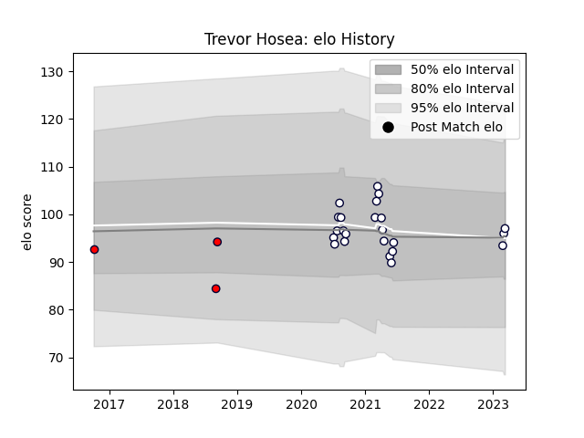

---  
layout: page  
title: Trevor Hosea  
date: 2023-03-16 19:51:41.613172  
categories: player  
---
# Trevor Hosea

## Positions: L

## Current elo: 97.0

## Current Percentile: 53.0

# Elo History

# Match History

| Team             |   Appearances |   Win Rate |
|:-----------------|--------------:|-----------:|
| Melbourne Rebels |            23 |   0.326087 |
| Melbourne Rising |             3 |   0        |

| Opponent                 |   Matches |   Win Rate |
|:-------------------------|----------:|-----------:|
| Queensland Reds          |         5 |       0.1  |
| Western Force            |         5 |       0.6  |
| Brumbies                 |         4 |       0.25 |
| New South Wales Waratahs |         4 |       0.75 |
| Hurricanes               |         2 |       0    |
| Chiefs                   |         1 |       0    |
| Crusaders                |         1 |       0    |
| Fijian Drua              |         1 |       0    |
| Greater Sydney Rams      |         1 |       0    |
| Highlanders              |         1 |       0    |
| Queensland Country       |         1 |       0    |