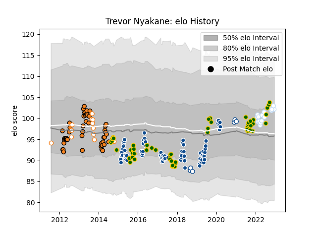

---  
layout: page  
title: Trevor Nyakane  
date: 2022-12-18 16:24:40.955751  
categories: player  
---
# Trevor Nyakane

## Positions: P

## Country: South Africa

## Current elo: 102.0

## Current Percentile: 74.0

# Elo History

# Match History

| Team                |   Appearances |   Win Rate |
|:--------------------|--------------:|-----------:|
| Bulls               |            72 |   0.423611 |
| South Africa        |            51 |   0.617647 |
| Cheetahs            |            48 |   0.40625  |
| Racing 92           |            17 |   0.705882 |
| Free State Cheetahs |            12 |   0.416667 |
| Blue Bulls          |             6 |   0.5      |

| Opponent                 |   Matches |   Win Rate |
|:-------------------------|----------:|-----------:|
| Stormers                 |        16 |  0.3125    |
| Sharks                   |        14 |  0.607143  |
| New Zealand              |        11 |  0.318182  |
| Argentina                |        10 |  0.9       |
| Lions                    |         9 |  0.444444  |
| Australia                |         8 |  0.5       |
| Chiefs                   |         7 |  0.0714286 |
| Queensland Reds          |         7 |  0.571429  |
| Melbourne Rebels         |         7 |  0.714286  |
| Brumbies                 |         7 |  0.142857  |
| Bulls                    |         6 |  0.166667  |
| Wales                    |         6 |  0.5       |
| Highlanders              |         6 |  0.416667  |
| Blues                    |         6 |  0.25      |
| Crusaders                |         6 |  0.166667  |
| Hurricanes               |         5 |  0.2       |
| Jaguares                 |         5 |  0.2       |
| Western Force            |         5 |  0.8       |
| Golden Lions             |         5 |  0.4       |
| Cheetahs                 |         4 |  0.5       |
| Blue Bulls               |         4 |  0.5       |
| New South Wales Waratahs |         4 |  0.75      |
| Sunwolves                |         3 |  0.666667  |
| Pau                      |         3 |  1         |
| Southern Kings           |         3 |  1         |
| Natal Sharks             |         3 |  0         |
| Western Province         |         3 |  0.333333  |
| Griquas                  |         3 |  1         |
| Bordeaux Begles          |         3 |  0.333333  |
| British and Irish Lions  |         3 |  0.666667  |
| Japan                    |         2 |  0.5       |
| Italy                    |         2 |  1         |
| Ireland                  |         2 |  0.5       |
| Scotland                 |         2 |  1         |
| Brive                    |         2 |  1         |
| Stade Francais Paris     |         1 |  1         |
| Biarritz Olympique       |         1 |  1         |
| United States of America |         1 |  1         |
| Toulon                   |         1 |  1         |
| Stade Toulousain         |         1 |  1         |
| Leinster                 |         1 |  0         |
| Clermont Auvergne        |         1 |  1         |
| La Rochelle              |         1 |  0         |
| Samoa                    |         1 |  1         |
| France                   |         1 |  1         |
| Perpignan                |         1 |  0         |
| Georgia                  |         1 |  1         |
| Montpellier Herault      |         1 |  1         |
| England                  |         1 |  0         |