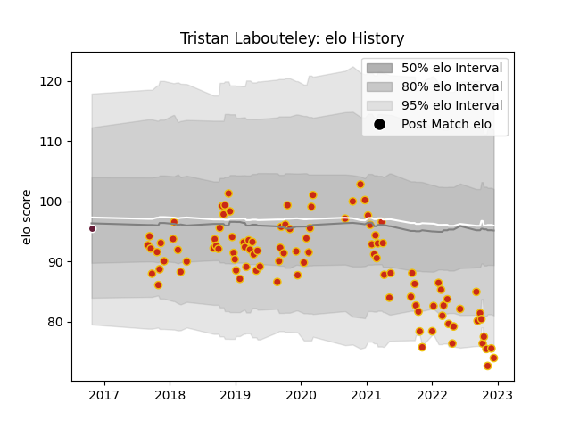

---  
layout: page  
title: Tristan Labouteley  
date: 2022-12-14 11:17:36.415331  
categories: player  
---
# Tristan Labouteley

## Positions: L

## Current elo: 74.0

## Current Percentile: 5.0

# Elo History

# Match History

| Team            |   Appearances |   Win Rate |
|:----------------|--------------:|-----------:|
| Perpignan       |            99 |   0.449495 |
| Bordeaux Begles |             1 |   0        |

| Opponent                   |   Matches |   Win Rate |
|:---------------------------|----------:|-----------:|
| Biarritz Olympique         |         7 |   0.714286 |
| Bordeaux Begles            |         6 |   0.416667 |
| Pau                        |         5 |   0        |
| Clermont Auvergne          |         5 |   0        |
| Toulon                     |         5 |   0.4      |
| Grenoble                   |         5 |   0.8      |
| Nevers                     |         4 |   0.5      |
| Aurillac                   |         4 |   0.875    |
| Racing 92                  |         4 |   0.25     |
| Stade Francais Paris       |         4 |   0        |
| Carcassonne                |         4 |   0.75     |
| Colomiers                  |         3 |   0.666667 |
| Castres Olympique          |         3 |   0.333333 |
| La Rochelle                |         3 |   0        |
| Lyon                       |         3 |   0.333333 |
| Mont-de-Marsan             |         3 |   0.333333 |
| Brive                      |         3 |   0.333333 |
| Montpellier Herault        |         3 |   0.333333 |
| Soyaux-Angouleme           |         3 |   0.833333 |
| Stade Toulousain           |         3 |   0.333333 |
| Rouen                      |         3 |   0.333333 |
| Montauban                  |         3 |   0.666667 |
| Agen                       |         2 |   0        |
| Provence Rugby             |         2 |   0.5      |
| Beziers                    |         2 |   0.5      |
| Vannes                     |         2 |   1        |
| Oyonnax                    |         1 |   1        |
| Roval Drome XV             |         1 |   1        |
| Narbonne                   |         1 |   1        |
| Connacht                   |         1 |   0        |
| Bristol Rugby              |         1 |   0        |
| Valence Romans Drome Rugby |         1 |   1        |