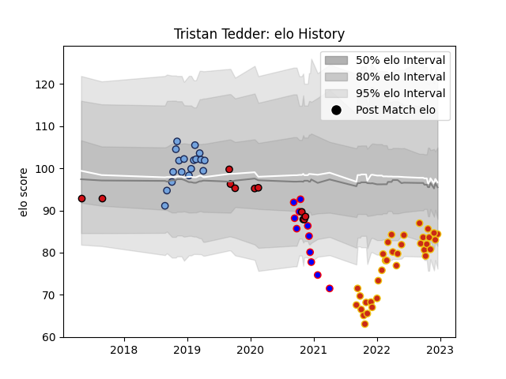

---  
layout: page  
title: Tristan Tedder  
date: 2022-12-18 16:12:19.156584  
categories: player  
---
# Tristan Tedder

## Positions: FH, FB

## Current elo: 85.0

## Current Percentile: 10.0

# Elo History

# Match History

| Team             |   Appearances |   Win Rate |
|:-----------------|--------------:|-----------:|
| Perpignan        |            35 |   0.371429 |
| Bayonne          |            18 |   0.638889 |
| Beziers          |            11 |   0.363636 |
| Stade Toulousain |            11 |   0.363636 |

| Opponent             |   Matches |   Win Rate |
|:---------------------|----------:|-----------:|
| Lyon                 |         4 |   0.25     |
| Bordeaux Begles      |         4 |   0.75     |
| Brive                |         4 |   0.25     |
| Stade Francais Paris |         4 |   0        |
| Castres Olympique    |         4 |   0.375    |
| Racing 92            |         4 |   0.5      |
| Pau                  |         4 |   0.25     |
| Mont-de-Marsan       |         3 |   0.166667 |
| Toulon               |         3 |   0.666667 |
| Stade Toulousain     |         3 |   0.333333 |
| Soyaux-Angouleme     |         3 |   0.333333 |
| Oyonnax              |         3 |   0.5      |
| Vannes               |         3 |   0.333333 |
| Clermont Auvergne    |         3 |   0.333333 |
| Carcassonne          |         3 |   0.666667 |
| Biarritz Olympique   |         3 |   0.666667 |
| La Rochelle          |         2 |   0.5      |
| Montauban            |         2 |   1        |
| Montpellier Herault  |         2 |   0        |
| Colomiers            |         2 |   1        |
| Rouen                |         2 |   0        |
| Beziers              |         2 |   0.5      |
| Aurillac             |         2 |   1        |
| Bayonne              |         1 |   0        |
| Nevers               |         1 |   1        |
| Grenoble             |         1 |   1        |
| Glasgow Warriors     |         1 |   0        |
| Provence Rugby       |         1 |   0        |
| US Bressane          |         1 |   1        |