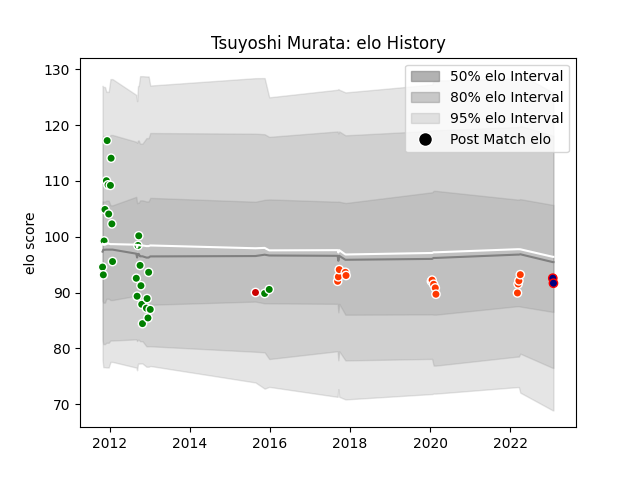

---  
layout: page  
title: Tsuyoshi Murata  
date: 2023-01-25 18:59:04.243097  
categories: player  
---
# Tsuyoshi Murata

## Positions: L, FL

## Country: Japan

## Current elo: 93.0

## Current Percentile: 42.0

# Elo History

# Match History

| Team                     |   Appearances |   Win Rate |
|:-------------------------|--------------:|-----------:|
| Green Rockets Tokatsu    |            27 |   0.537037 |
| Hino Red Dolphins        |            14 |   0.428571 |
| Hanazono Kintetsu Liners |             1 |   0        |
| Japan                    |             1 |   1        |

| Opponent                          |   Matches |   Win Rate |
|:----------------------------------|----------:|-----------:|
| Tokyo Sungoliath                  |         4 |   0        |
| Urayasu D-Rocks                   |         3 |   0.666667 |
| Mie Honda Heat                    |         3 |   0.333333 |
| Shizuoka Blue Revs                |         3 |   0.333333 |
| NTT Docomo Red Hurricanes Osaka   |         3 |   0.5      |
| Black Rams Tokyo                  |         2 |   0.5      |
| Saitama Wild Knights              |         2 |   0        |
| Toyota Verblitz                   |         2 |   0.5      |
| Hanazono Kintetsu Liners          |         2 |   0.5      |
| Kobelco Kobe Steelers             |         2 |   0        |
| Toshiba Brave Lupus Tokyo         |         2 |   0.5      |
| Kyuden Voltex                     |         2 |   1        |
| Munakata Sanix Blues              |         2 |   1        |
| Uruguay                           |         1 |   1        |
| Toyota Industries Shuttles Aichi  |         1 |   0        |
| Mitsubishi Dynaboars              |         1 |   0        |
| Chubu Electric Power              |         1 |   1        |
| Mazda Blue Zoomers                |         1 |   1        |
| Kubota Spears Funabashi Tokyo-Bay |         1 |   0        |
| Kamaishi Seawaves                 |         1 |   1        |
| Green Rockets Tokatsu             |         1 |   1        |
| Coca-Cola Red Sparks              |         1 |   1        |
| Chugoku Red Regulions             |         1 |   1        |
| Yokohama Canon Eagles             |         1 |   1        |