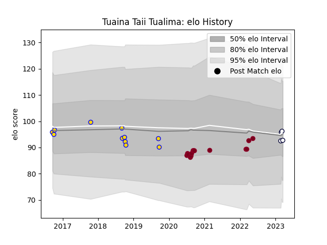

---  
layout: page  
title: Tuaina Taii Tualima  
date: 2023-03-21 18:23:57.548890  
categories: player  
---
# Tuaina Taii Tualima

Last updated: 2023-03-21
## Positions: L, FL

## Current elo: 93.0

## Current Percentile: 51.0

# Elo History

# Match History

| Team             |   Appearances |   Win Rate |
|:-----------------|--------------:|-----------:|
| Queensland Reds  |            14 |   0.75     |
| Brisbane City    |            11 |   0.454545 |
| Melbourne Rebels |             4 |   0.25     |

| Opponent                 |   Matches |   Win Rate |
|:-------------------------|----------:|-----------:|
| Western Force            |         5 |   0.6      |
| New South Wales Waratahs |         4 |   0.75     |
| Brumbies                 |         3 |   0.666667 |
| Melbourne Rebels         |         3 |   0.833333 |
| Canberra Vikings         |         2 |   0        |
| Fijian Drua              |         2 |   0.5      |
| Melbourne Rising         |         2 |   0.5      |
| NSW Country Eagles       |         2 |   1        |
| Queensland Country       |         2 |   1        |
| Blues                    |         1 |   0        |
| Chiefs                   |         1 |   0        |
| Hurricanes               |         1 |   0        |
| Perth Spirit             |         1 |   0        |