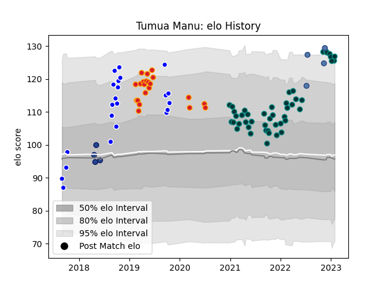

---  
layout: page  
title: Tumua Manu  
date: 2023-02-02 19:05:55.421142  
categories: player  
---
# Tumua Manu

## Positions: C, W

## Country: Samoa

## Current elo: 127.0

## Current Percentile: 94.0

# Elo History

# Match History

| Team     |   Appearances |   Win Rate |
|:---------|--------------:|-----------:|
| Pau      |            46 |   0.434783 |
| Auckland |            22 |   0.681818 |
| Chiefs   |            21 |   0.428571 |
| Blues    |             4 |   0.25     |
| Samoa    |             4 |   1        |

| Opponent                 |   Matches |   Win Rate |
|:-------------------------|----------:|-----------:|
| Stade Francais Paris     |         5 |   0.4      |
| Lyon                     |         4 |   0.5      |
| Toulon                   |         4 |   0.125    |
| Tasman                   |         4 |   0.25     |
| Bordeaux Begles          |         4 |   0.5      |
| Brive                    |         4 |   0.5      |
| Castres Olympique        |         4 |   0        |
| Hurricanes               |         4 |   0.125    |
| Crusaders                |         3 |   0.333333 |
| Taranaki                 |         3 |   0.666667 |
| Stade Toulousain         |         3 |   0.333333 |
| Montpellier Herault      |         3 |   0.666667 |
| Jaguares                 |         3 |   0.333333 |
| Highlanders              |         3 |   0.166667 |
| Wellington               |         3 |   0.666667 |
| Bayonne                  |         3 |   0.833333 |
| Perpignan                |         2 |   1        |
| Melbourne Rebels         |         2 |   0.5      |
| Racing 92                |         2 |   0        |
| Blues                    |         2 |   0.5      |
| Biarritz Olympique       |         2 |   1        |
| New South Wales Waratahs |         2 |   1        |
| Canterbury               |         2 |   1        |
| La Rochelle              |         2 |   0        |
| Waikato                  |         2 |   0.5      |
| Clermont Auvergne        |         2 |   0.5      |
| Counties Manukau         |         2 |   1        |
| Southland                |         2 |   1        |
| Tonga                    |         1 |   1        |
| Sharks                   |         1 |   1        |
| Sunwolves                |         1 |   0        |
| Brumbies                 |         1 |   0        |
| Bulls                    |         1 |   1        |
| Fiji                     |         1 |   1        |
| Romania                  |         1 |   1        |
| Queensland Reds          |         1 |   1        |
| Georgia                  |         1 |   1        |
| Otago                    |         1 |   0        |
| Northland                |         1 |   1        |
| North Harbour            |         1 |   1        |
| Bay of Plenty            |         1 |   1        |
| Lions                    |         1 |   0        |
| Cheetahs                 |         1 |   0        |
| Agen                     |         1 |   1        |