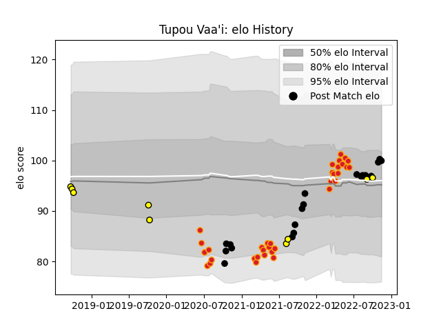

---  
layout: page  
title: Tupou Vaa'i  
date: 2022-11-16 11:35:41.363474  
categories: player  
---
# Tupou Vaa'i

## Positions: L

## Country: New Zealand

## Current elo: 100.0

## Current Percentile: 67.0

# Elo History

# Match History

| Team        |   Appearances |   Win Rate |
|:------------|--------------:|-----------:|
| Chiefs      |            34 |   0.558824 |
| New Zealand |            19 |   0.710526 |
| Taranaki    |             9 |   0.222222 |

| Opponent                 |   Matches |   Win Rate |
|:-------------------------|----------:|-----------:|
| Crusaders                |         7 |   0.285714 |
| Australia                |         6 |   0.75     |
| Hurricanes               |         5 |   0.6      |
| Argentina                |         4 |   0.5      |
| Highlanders              |         4 |   0.25     |
| Moana Pasifika           |         4 |   1        |
| Auckland                 |         3 |   0        |
| Blues                    |         3 |   0        |
| New South Wales Waratahs |         3 |   1        |
| Wales                    |         2 |   1        |
| Waikato                  |         2 |   0        |
| South Africa             |         2 |   0.5      |
| Queensland Reds          |         2 |   0.5      |
| Western Force            |         2 |   1        |
| Brumbies                 |         2 |   0.5      |
| Melbourne Rebels         |         1 |   1        |
| Italy                    |         1 |   1        |
| Ireland                  |         1 |   0        |
| North Harbour            |         1 |   0        |
| Northland                |         1 |   1        |
| Hawke's Bay              |         1 |   1        |
| Scotland                 |         1 |   1        |
| Fijian Drua              |         1 |   1        |
| United States of America |         1 |   1        |
| Canterbury               |         1 |   0        |
| Japan                    |         1 |   1        |