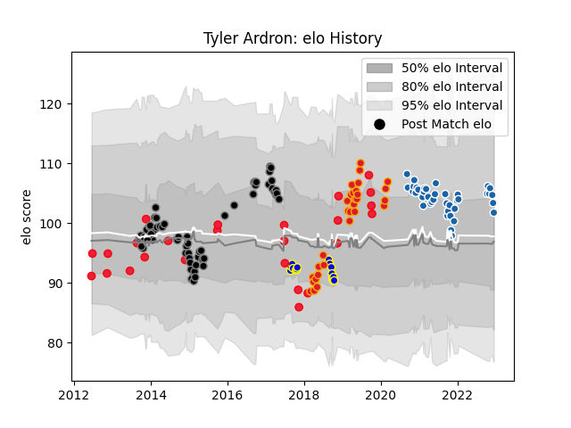

---  
layout: page  
title: Tyler Ardron  
date: 2023-01-13 11:33:19.258217  
categories: player  
---
# Tyler Ardron

## Positions: N8, FL

## Country: Canada

## Current elo: 102.0

## Current Percentile: 73.0

# Elo History

# Match History

| Team              |   Appearances |   Win Rate |
|:------------------|--------------:|-----------:|
| Ospreys           |            64 |   0.539062 |
| Castres Olympique |            41 |   0.585366 |
| Chiefs            |            30 |   0.666667 |
| Canada            |            26 |   0.25     |
| Bay of Plenty     |            15 |   0.466667 |

| Opponent                 |   Matches |   Win Rate |
|:-------------------------|----------:|-----------:|
| Leinster                 |         8 |   0.125    |
| Stade Francais Paris     |         6 |   0.166667 |
| Benetton Treviso         |         6 |   0.666667 |
| Zebre                    |         5 |   1        |
| Glasgow Warriors         |         5 |   0.4      |
| Racing 92                |         5 |   0.5      |
| Scarlets                 |         5 |   0.6      |
| Edinburgh                |         5 |   0.6      |
| Blues                    |         5 |   0.8      |
| Munster                  |         4 |   0.25     |
| United States of America |         4 |   0.375    |
| Connacht                 |         4 |   1        |
| Highlanders              |         4 |   0.625    |
| Dragons                  |         4 |   1        |
| Pau                      |         4 |   1        |
| Ulster                   |         4 |   0.25     |
| Georgia                  |         3 |   0.333333 |
| Bayonne                  |         3 |   1        |
| La Rochelle              |         3 |   0.666667 |
| Jaguares                 |         3 |   0.333333 |
| Italy                    |         3 |   0        |
| Brive                    |         3 |   0.666667 |
| Romania                  |         3 |   0        |
| Bordeaux Begles          |         3 |   0.166667 |
| Crusaders                |         3 |   0.666667 |
| Stade Toulousain         |         3 |   0.5      |
| Cardiff Blues            |         3 |   0.666667 |
| Montpellier Herault      |         3 |   0.666667 |
| Waikato                  |         2 |   0.5      |
| Queensland Reds          |         2 |   1        |
| Manawatu                 |         2 |   0.5      |
| Otago                    |         2 |   0.5      |
| Northland                |         2 |   0.5      |
| Northampton Saints       |         2 |   0        |
| Sharks                   |         2 |   0.5      |
| New Zealand Maori        |         2 |   0        |
| Sunwolves                |         2 |   1        |
| Toulon                   |         2 |   1        |
| Lyon                     |         2 |   0        |
| Exeter Chiefs            |         2 |   0        |
| Clermont Auvergne        |         2 |   0.5      |
| Castres Olympique        |         2 |   0.5      |
| Brumbies                 |         2 |   0.5      |
| Hurricanes               |         2 |   0.25     |
| Taranaki                 |         1 |   0        |
| South Africa             |         1 |   0        |
| Southland                |         1 |   1        |
| Stormers                 |         1 |   1        |
| Canterbury               |         1 |   0        |
| Bulls                    |         1 |   1        |
| Scotland                 |         1 |   0        |
| Bristol Rugby            |         1 |   1        |
| Uruguay                  |         1 |   0        |
| Biarritz Olympique       |         1 |   1        |
| Wasps                    |         1 |   1        |
| Wellington               |         1 |   0        |
| Counties Manukau         |         1 |   1        |
| Melbourne Rebels         |         1 |   1        |
| Bath Rugby               |         1 |   1        |
| Samoa                    |         1 |   0        |
| Russia                   |         1 |   1        |
| France                   |         1 |   0        |
| Germany                  |         1 |   1        |
| Harlequins               |         1 |   0        |
| Perpignan                |         1 |   1        |
| Hawke's Bay              |         1 |   1        |
| Hong Kong                |         1 |   1        |
| Ireland                  |         1 |   0        |
| North Harbour            |         1 |   0        |
| Kenya                    |         1 |   1        |
| New Zealand              |         1 |   0        |
| New South Wales Waratahs |         1 |   1        |
| Lions                    |         1 |   0        |
| Agen                     |         1 |   1        |