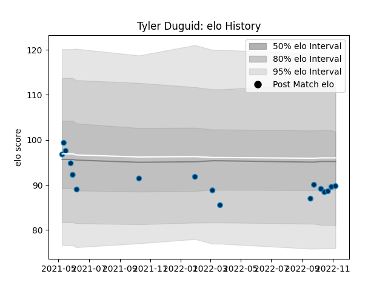

---  
layout: page  
title: Tyler Duguid  
date: 2023-02-05 15:12:22.070952  
categories: player  
---
# Tyler Duguid

## Positions: L

## Current elo: 71.0

## Current Percentile: 8.0

# Elo History

# Match History

| Team                |   Appearances |   Win Rate |
|:--------------------|--------------:|-----------:|
| Montpellier Herault |            22 |   0.454545 |

| Opponent             |   Matches |   Win Rate |
|:---------------------|----------:|-----------:|
| Toulon               |         3 |   0.666667 |
| Bayonne              |         2 |   1        |
| Bordeaux Begles      |         2 |   0        |
| Castres Olympique    |         2 |   0        |
| La Rochelle          |         2 |   1        |
| Pau                  |         2 |   0.5      |
| Stade Francais Paris |         2 |   0.5      |
| Brive                |         1 |   1        |
| Clermont Auvergne    |         1 |   0        |
| Leicester Tigers     |         1 |   1        |
| Leinster             |         1 |   0        |
| Lyon                 |         1 |   0        |
| Racing 92            |         1 |   0        |
| Stade Toulousain     |         1 |   0        |