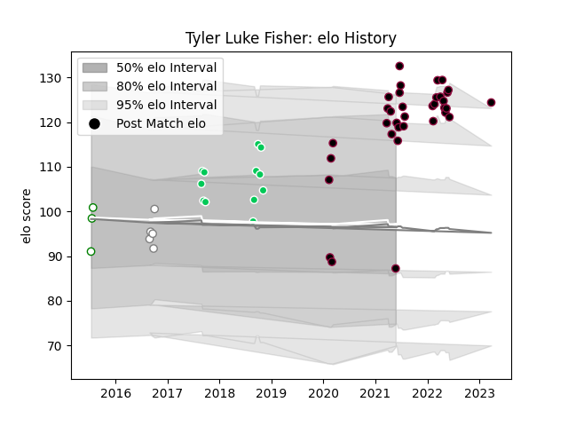

---  
layout: page  
title: Tyler Luke Fisher  
date: 2023-03-29 11:28:42.550922  
categories: player  
---
# Tyler Luke Fisher

Last updated: 2023-03-29
## Positions: C

## Current elo: 87.0

## Current Percentile: 88.0

# Elo History

# Match History

| Team          |   Appearances |   Win Rate |
|:--------------|--------------:|-----------:|
| Utah Warriors |            35 |   0.528571 |
| SWD Eagles    |            12 |   0.708333 |
| Pumas         |             5 |   0.2      |
| Leopards      |             3 |   1        |

| Opponent               |   Matches |   Win Rate |
|:-----------------------|----------:|-----------:|
| Seattle Seawolves      |         4 |   0.5      |
| San Diego Legion       |         4 |   0.25     |
| L. A. Giltinis         |         4 |   0.5      |
| Austin Gilgronis       |         3 |   0.666667 |
| New England Free Jacks |         3 |   0.333333 |
| Boland Cavaliers       |         3 |   0.666667 |
| Border Bulldogs        |         3 |   1        |
| Valke                  |         3 |   1        |
| Griffons               |         3 |   0.666667 |
| Rugby ATL              |         3 |   0.333333 |
| Houston SaberCats      |         3 |   0.666667 |
| Toronto Arrows         |         2 |   1        |
| Leopards               |         2 |   0.25     |
| Austin Herd            |         2 |   0.75     |
| Free State Cheetahs    |         2 |   0        |
| Dallas Jackals         |         2 |   1        |
| NOLA Gold              |         1 |   0        |
| Namibia Welwitchias    |         1 |   1        |
| Old Glory DC           |         1 |   0        |
| R.U. New York          |         1 |   1        |
| Griquas                |         1 |   0        |
| Rugby New York         |         1 |   1        |
| Eastern Province Kings |         1 |   1        |
| Colorado Raptors       |         1 |   0        |
| Western Province       |         1 |   0        |