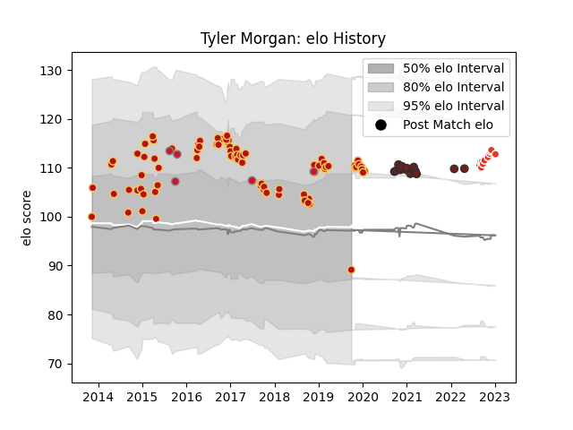

---  
layout: page  
title: Tyler Morgan  
date: 2023-01-06 11:43:07.542801  
categories: player  
---
# Tyler Morgan

## Positions: C

## Country: Wales

## Current elo: 89.0

## Current Percentile: 76.0

# Elo History

# Match History

| Team               |   Appearances |   Win Rate |
|:-------------------|--------------:|-----------:|
| Dragons            |            87 |   0.385057 |
| Scarlets           |            16 |   0.5625   |
| Biarritz Olympique |            11 |   0.727273 |
| Wales              |             5 |   0.6      |

| Opponent             |   Matches |   Win Rate |
|:---------------------|----------:|-----------:|
| Edinburgh            |        10 |   0.4      |
| Ospreys              |        10 |   0.3      |
| Cardiff Blues        |         9 |   0.222222 |
| Munster              |         8 |   0        |
| Benetton Treviso     |         8 |   0.625    |
| Scarlets             |         7 |   0.285714 |
| Leinster             |         7 |   0.142857 |
| Connacht             |         6 |   0.5      |
| Worcester Warriors   |         5 |   0.6      |
| Zebre                |         5 |   0.6      |
| RC Enisei            |         4 |   1        |
| Ulster               |         4 |   0        |
| Glasgow Warriors     |         3 |   0.5      |
| Gloucester Rugby     |         2 |   0.5      |
| Dragons              |         2 |   1        |
| Southern Kings       |         2 |   1        |
| Montauban            |         2 |   1        |
| Newcastle Falcons    |         2 |   0.5      |
| Timisoara Saracens   |         1 |   1        |
| South Africa         |         1 |   0        |
| Stade Francais Paris |         1 |   1        |
| Fiji                 |         1 |   1        |
| Tonga                |         1 |   1        |
| Carcassonne          |         1 |   1        |
| Vannes               |         1 |   0        |
| Wasps                |         1 |   1        |
| Brive                |         1 |   1        |
| Toulon               |         1 |   0        |
| Oyonnax              |         1 |   1        |
| Samoa                |         1 |   1        |
| Provence Rugby       |         1 |   1        |
| Castres Olympique    |         1 |   1        |
| Northampton Saints   |         1 |   0        |
| Nevers               |         1 |   0.5      |
| Clermont Auvergne    |         1 |   0        |
| Montpellier Herault  |         1 |   0        |
| Mont-de-Marsan       |         1 |   0        |
| Massy                |         1 |   1        |
| Ireland              |         1 |   0        |
| Grenoble             |         1 |   0.5      |
| Aurillac             |         1 |   1        |