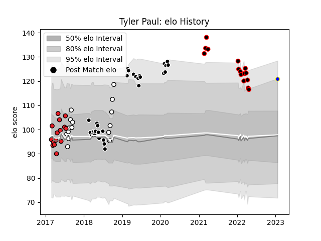

---  
layout: page  
title: Tyler Paul  
date: 2023-01-21 15:44:17.851877  
categories: player  
---
# Tyler Paul

## Positions: FL, L

## Current elo: 121.0

## Current Percentile: 88.0

# Elo History

# Match History

| Team                            |   Appearances |   Win Rate |
|:--------------------------------|--------------:|-----------:|
| Sharks                          |            30 |   0.483333 |
| NTT Docomo Red Hurricanes Osaka |            15 |   0.266667 |
| Natal Sharks                    |            15 |   0.866667 |
| Southern Kings                  |            15 |   0.4      |
| Urayasu D-Rocks                 |             1 |   1        |

| Opponent                          |   Matches |   Win Rate |
|:----------------------------------|----------:|-----------:|
| Stormers                          |         6 |   0.5      |
| Jaguares                          |         6 |   0.5      |
| Bulls                             |         4 |   0.5      |
| Lions                             |         4 |   0.25     |
| Brumbies                          |         3 |   0        |
| Free State Cheetahs               |         3 |   0.666667 |
| Griquas                           |         3 |   1        |
| Hurricanes                        |         3 |   0        |
| Pumas                             |         3 |   1        |
| Toshiba Brave Lupus Tokyo         |         2 |   0        |
| Tokyo Sungoliath                  |         2 |   0        |
| Sunwolves                         |         2 |   1        |
| New South Wales Waratahs          |         2 |   0.75     |
| Sharks                            |         2 |   0.5      |
| Saitama Wild Knights              |         2 |   0        |
| Queensland Reds                   |         2 |   0        |
| Western Province                  |         2 |   0.5      |
| Black Rams Tokyo                  |         2 |   0.5      |
| Yokohama Canon Eagles             |         2 |   0.5      |
| Melbourne Rebels                  |         2 |   1        |
| Blue Bulls                        |         2 |   1        |
| Hino Red Dolphins                 |         2 |   1        |
| Highlanders                       |         2 |   1        |
| Golden Lions                      |         2 |   1        |
| Chiefs                            |         2 |   0.5      |
| Blues                             |         2 |   1        |
| Green Rockets Tokatsu             |         1 |   1        |
| Shizuoka Blue Revs                |         1 |   0        |
| Crusaders                         |         1 |   0        |
| Cheetahs                          |         1 |   0        |
| Toyota Verblitz                   |         1 |   0        |
| Western Force                     |         1 |   0        |
| Kubota Spears Funabashi Tokyo-Bay |         1 |   0        |