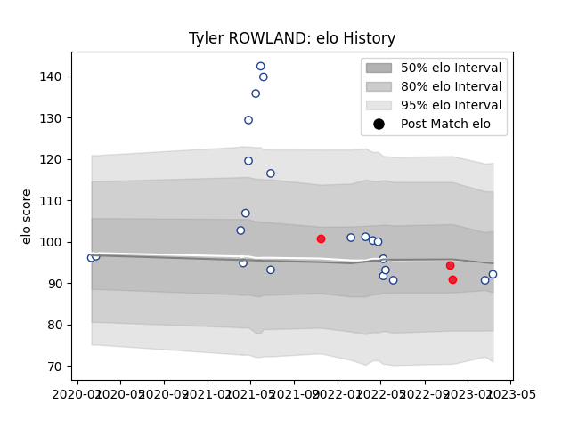

---  
layout: page  
title: Tyler ROWLAND  
date: 2023-03-17 17:30:52.785286  
categories: player  
---
# Tyler ROWLAND

## Positions: P

## Country: Canada

## Current elo: 92.0

## Current Percentile: 35.0

# Elo History

# Match History

| Team           |   Appearances |   Win Rate |
|:---------------|--------------:|-----------:|
| Toronto Arrows |            22 |   0.5      |
| Canada         |             3 |   0.666667 |

| Opponent               |   Matches |   Win Rate |
|:-----------------------|----------:|-----------:|
| Old Glory DC           |         3 |   0.666667 |
| R.U. New York          |         3 |   0.333333 |
| Rugby New York         |         3 |   0.333333 |
| Seattle Seawolves      |         3 |   0.666667 |
| Houston SaberCats      |         2 |   0.5      |
| Austin Herd            |         1 |   1        |
| Belgium                |         1 |   1        |
| Chicago Hounds         |         1 |   1        |
| Dallas Jackals         |         1 |   1        |
| L. A. Giltinis         |         1 |   0        |
| Namibia                |         1 |   0        |
| Netherlands            |         1 |   1        |
| New England Free Jacks |         1 |   0        |
| Rugby ATL              |         1 |   0        |
| San Diego Legion       |         1 |   0        |
| Utah Warriors          |         1 |   1        |