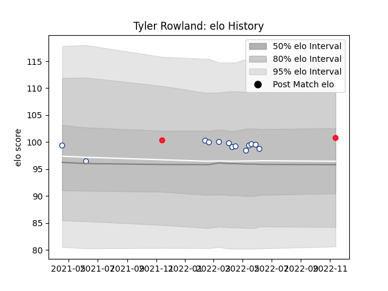

---  
layout: page  
title: Tyler Rowland  
date: 2022-11-15 23:37:10.640134  
categories: player  
---
# Tyler Rowland

## Positions: P

## Country: Canada

## Current elo: 102.0

## Current Percentile: 69.0

# Elo History

# Match History

| Team           |   Appearances |   Win Rate |
|:---------------|--------------:|-----------:|
| Toronto Arrows |             5 |        0.4 |
| Canada         |             2 |        1   |

| Opponent          |   Matches |   Win Rate |
|:------------------|----------:|-----------:|
| Seattle Seawolves |         2 |        0.5 |
| Belgium           |         1 |        1   |
| Houston SaberCats |         1 |        0   |
| Netherlands       |         1 |        1   |
| San Diego Legion  |         1 |        0   |
| Utah Warriors     |         1 |        1   |