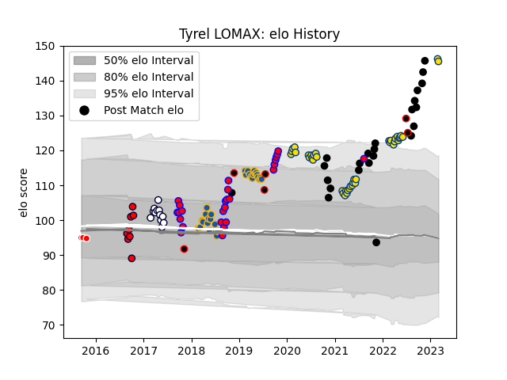

---  
layout: page  
title: Tyrel LOMAX  
date: 2023-03-17 17:28:20.284701  
categories: player  
---
# Tyrel LOMAX

## Positions: P

## Country: New Zealand

## Current elo: 144.0

## Current Percentile: 99.0

# Elo History

# Match History

| Team              |   Appearances |   Win Rate |
|:------------------|--------------:|-----------:|
| Hurricanes        |            42 |   0.547619 |
| Highlanders       |            30 |   0.5      |
| Tasman            |            26 |   0.807692 |
| New Zealand       |            23 |   0.73913  |
| Melbourne Rebels  |            12 |   0.125    |
| Melbourne Rising  |             8 |   0.375    |
| New Zealand Maori |             6 |   0.666667 |
| Canberra Vikings  |             3 |   1        |

| Opponent                 |   Matches |   Win Rate |
|:-------------------------|----------:|-----------:|
| Blues                    |        12 |   0.416667 |
| Chiefs                   |        10 |   0.35     |
| Crusaders                |        10 |   0.1      |
| New South Wales Waratahs |         8 |   0.5      |
| Argentina                |         6 |   0.666667 |
| Highlanders              |         6 |   0.666667 |
| Queensland Reds          |         6 |   0.833333 |
| Australia                |         5 |   0.7      |
| Brumbies                 |         5 |   0.2      |
| Melbourne Rebels         |         4 |   1        |
| Auckland                 |         4 |   0.75     |
| Hurricanes               |         4 |   0.25     |
| Taranaki                 |         3 |   0.666667 |
| Stormers                 |         3 |   0.333333 |
| Sharks                   |         3 |   0.5      |
| Ireland                  |         3 |   0.333333 |
| Lions                    |         3 |   0.333333 |
| Fiji                     |         3 |   0.666667 |
| Canterbury               |         3 |   0.333333 |
| Bulls                    |         2 |   0.75     |
| Southland                |         2 |   1        |
| North Harbour            |         2 |   1        |
| Sunwolves                |         2 |   1        |
| NSW Country Eagles       |         2 |   0        |
| Perth Spirit             |         2 |   0.5      |
| South Africa             |         2 |   0.5      |
| North Harbour Rays       |         2 |   0.5      |
| Otago                    |         2 |   1        |
| Japan                    |         2 |   1        |
| Jaguares                 |         2 |   1        |
| Wales                    |         2 |   1        |
| Counties Manukau         |         2 |   0.5      |
| Wellington               |         2 |   1        |
| Hawke's Bay              |         2 |   1        |
| Southern Kings           |         1 |   0        |
| Fijian Drua              |         1 |   1        |
| Brisbane City            |         1 |   1        |
| Bay of Plenty            |         1 |   1        |
| United States of America |         1 |   1        |
| Waikato                  |         1 |   1        |
| Tonga                    |         1 |   1        |
| Northland                |         1 |   1        |
| Canada                   |         1 |   1        |
| Queensland Country       |         1 |   1        |
| Greater Sydney Rams      |         1 |   0        |
| Canberra Vikings         |         1 |   1        |
| Moana Pasifika           |         1 |   0        |
| Melbourne Rising         |         1 |   1        |
| Manawatu                 |         1 |   1        |
| Chile                    |         1 |   1        |
| Italy                    |         1 |   1        |
| England                  |         1 |   0.5      |
| Western Force            |         1 |   1        |