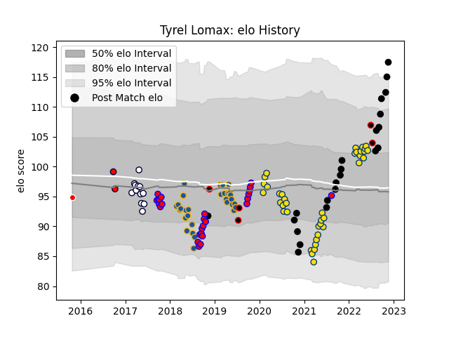

---  
layout: page  
title: Tyrel Lomax  
date: 2022-11-22 11:40:44.693932  
categories: player  
---
# Tyrel Lomax

## Positions: P

## Country: New Zealand

## Current elo: 117.0

## Current Percentile: 95.0

# Elo History

# Match History

| Team              |   Appearances |   Win Rate |
|:------------------|--------------:|-----------:|
| Hurricanes        |            38 |   0.526316 |
| Highlanders       |            30 |   0.5      |
| Tasman            |            26 |   0.807692 |
| New Zealand       |            22 |   0.772727 |
| Melbourne Rebels  |            12 |   0.125    |
| New Zealand Maori |             5 |   0.6      |
| Melbourne Rising  |             2 |   0.5      |
| Canberra Vikings  |             1 |   1        |

| Opponent                 |   Matches |   Win Rate |
|:-------------------------|----------:|-----------:|
| Blues                    |        11 |   0.454545 |
| Chiefs                   |        10 |   0.35     |
| Crusaders                |        10 |   0.1      |
| New South Wales Waratahs |         7 |   0.428571 |
| Argentina                |         6 |   0.666667 |
| Highlanders              |         6 |   0.666667 |
| Australia                |         5 |   0.7      |
| Brumbies                 |         5 |   0.2      |
| Queensland Reds          |         5 |   0.8      |
| Auckland                 |         4 |   0.75     |
| Hurricanes               |         4 |   0.25     |
| Taranaki                 |         3 |   0.666667 |
| Stormers                 |         3 |   0.333333 |
| Sharks                   |         3 |   0.5      |
| Melbourne Rebels         |         3 |   1        |
| Lions                    |         3 |   0.333333 |
| Fiji                     |         3 |   0.666667 |
| Canterbury               |         3 |   0.333333 |
| Hawke's Bay              |         2 |   1        |
| Counties Manukau         |         2 |   0.5      |
| Southland                |         2 |   1        |
| Otago                    |         2 |   1        |
| Bulls                    |         2 |   0.75     |
| Sunwolves                |         2 |   1        |
| North Harbour            |         2 |   1        |
| South Africa             |         2 |   0.5      |
| Wales                    |         2 |   1        |
| Japan                    |         2 |   1        |
| Jaguares                 |         2 |   1        |
| Wellington               |         2 |   1        |
| Ireland                  |         2 |   0.5      |
| Southern Kings           |         1 |   0        |
| Tonga                    |         1 |   1        |
| Bay of Plenty            |         1 |   1        |
| Waikato                  |         1 |   1        |
| United States of America |         1 |   1        |
| Northland                |         1 |   1        |
| Canberra Vikings         |         1 |   1        |
| Fijian Drua              |         1 |   1        |
| North Harbour Rays       |         1 |   0        |
| Chile                    |         1 |   1        |
| Moana Pasifika           |         1 |   0        |
| Melbourne Rising         |         1 |   1        |
| Manawatu                 |         1 |   1        |
| England                  |         1 |   0.5      |
| Italy                    |         1 |   1        |
| Western Force            |         1 |   1        |