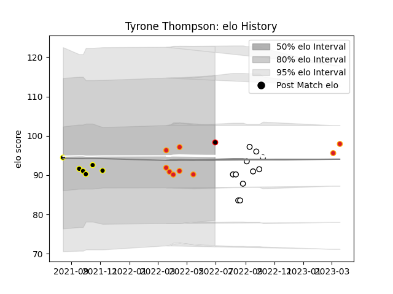

---  
layout: page  
title: Tyrone Thompson  
date: 2023-03-21 18:22:27.588618  
categories: player  
---
# Tyrone Thompson

Last updated: 2023-03-21
## Positions: H

## Country: New Zealand Maori

## Current elo: 98.0

## Current Percentile: 41.0

# Elo History

# Match History

| Team              |   Appearances |   Win Rate |
|:------------------|--------------:|-----------:|
| Hawke's Bay       |            11 |   0.5      |
| Chiefs            |             9 |   0.888889 |
| Wellington        |             6 |   0.166667 |
| New Zealand Maori |             1 |   1        |

| Opponent         |   Matches |   Win Rate |
|:-----------------|----------:|-----------:|
| Moana Pasifika   |         5 |       1    |
| Bay of Plenty    |         2 |       0    |
| Manawatu         |         2 |       1    |
| Waikato          |         2 |       0.25 |
| Tasman           |         2 |       0.5  |
| Melbourne Rebels |         2 |       1    |
| Wellington       |         2 |       0    |
| Ireland          |         1 |       1    |
| Hurricanes       |         1 |       1    |
| Canterbury       |         1 |       0    |
| Hawke's Bay      |         1 |       0    |
| North Harbour    |         1 |       1    |
| Otago            |         1 |       0    |
| Southland        |         1 |       1    |
| Taranaki         |         1 |       0    |
| Crusaders        |         1 |       0    |
| Counties Manukau |         1 |       1    |