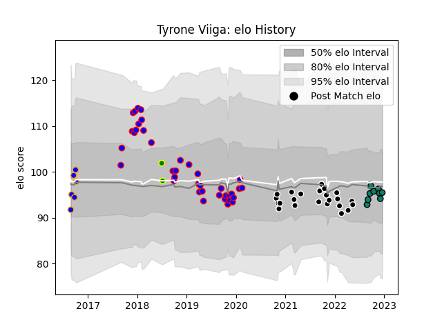

---  
layout: page  
title: Tyrone Viiga  
date: 2022-12-12 15:25:05.454475  
categories: player  
---
# Tyrone Viiga

## Positions: N8

## Country: Cook Islands

## Current elo: 94.0

## Current Percentile: 46.0

# Elo History

# Match History

| Team                |   Appearances |   Win Rate |
|:--------------------|--------------:|-----------:|
| Beziers             |            38 |   0.618421 |
| Provence Rugby      |            23 |   0.608696 |
| Montauban           |             8 |   0.4375   |
| Greater Sydney Rams |             6 |   0.333333 |
| Cook Islands        |             2 |   0        |

| Opponent                   |   Matches |   Win Rate |
|:---------------------------|----------:|-----------:|
| Aurillac                   |         6 |   0.5      |
| Rouen                      |         6 |   0.583333 |
| Carcassonne                |         5 |   0.6      |
| Nevers                     |         5 |   0.7      |
| Colomiers                  |         5 |   0.6      |
| Vannes                     |         5 |   0.5      |
| Biarritz Olympique         |         5 |   0.2      |
| Grenoble                   |         4 |   0.5      |
| Mont-de-Marsan             |         3 |   1        |
| US Bressane                |         3 |   0.5      |
| Soyaux-Angouleme           |         3 |   0.333333 |
| Oyonnax                    |         3 |   0.666667 |
| Montauban                  |         3 |   0.666667 |
| Massy                      |         2 |   1        |
| Perpignan                  |         2 |   0.5      |
| Provence Rugby             |         2 |   1        |
| Beziers                    |         2 |   0.5      |
| Hong Kong                  |         2 |   0        |
| Melbourne Rising           |         1 |   1        |
| Bayonne                    |         1 |   1        |
| NSW Country Eagles         |         1 |   0        |
| Narbonne                   |         1 |   0        |
| Brisbane City              |         1 |   0        |
| North Harbour Rays         |         1 |   0        |
| Queensland Country         |         1 |   1        |
| Roval Drome XV             |         1 |   1        |
| Dax                        |         1 |   1        |
| Valence Romans Drome Rugby |         1 |   1        |
| Canberra Vikings           |         1 |   0        |