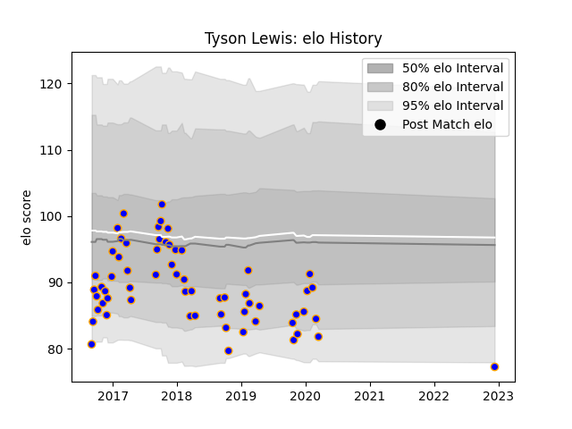

---  
layout: page  
title: Tyson Lewis  
date: 2022-12-14 11:34:31.099548  
categories: player  
---
# Tyson Lewis

## Positions: W

## Current elo: 77.0

## Current Percentile: None

# Elo History

# Match History

| Team      |   Appearances |   Win Rate |
|:----------|--------------:|-----------:|
| Doncaster |            62 |   0.427419 |

| Opponent            |   Matches |   Win Rate |
|:--------------------|----------:|-----------:|
| Cornish Pirates     |         6 |   0        |
| Nottingham          |         6 |   0.666667 |
| Yorkshire Carnegie  |         6 |   0.333333 |
| Bedford             |         5 |   0.5      |
| Jersey              |         5 |   0.4      |
| London Scottish     |         5 |   1        |
| Richmond            |         5 |   0.6      |
| Ealing Trailfinders |         4 |   0        |
| Hartpury College    |         4 |   0.75     |
| London Irish        |         4 |   0        |
| Rotherham Titans    |         4 |   1        |
| Coventry            |         3 |   0.333333 |
| Bristol Rugby       |         2 |   0        |
| Ampthill            |         1 |   0        |
| London Welsh        |         1 |   0        |
| Newcastle Falcons   |         1 |   0        |