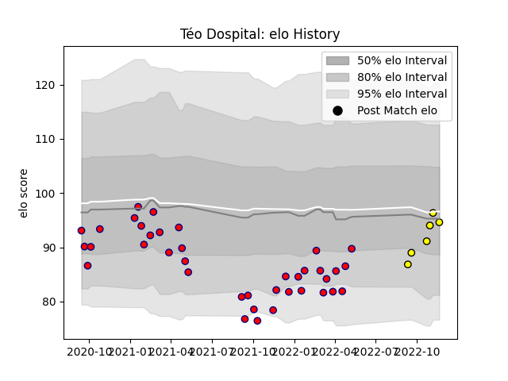

---  
layout: page  
title: Téo Dospital  
date: 2023-03-16 20:08:32.420695  
categories: player  
---
# Téo Dospital

## Positions: FB

## Current elo: 113.0

## Current Percentile: 75.0

# Elo History

# Match History

| Team                       |   Appearances |   Win Rate |
|:---------------------------|--------------:|-----------:|
| Cognac Saint Jean d'Angély |            38 |   0.381579 |
| Albi                       |            16 |   0.71875  |

| Opponent                   |   Matches |   Win Rate |
|:---------------------------|----------:|-----------:|
| Suresnes                   |         6 |   0.5      |
| Dax                        |         5 |   1        |
| Blagnac                    |         4 |   0.5      |
| Tarbes                     |         4 |   0.125    |
| Nice                       |         4 |   0.375    |
| Albi                       |         3 |   0.333333 |
| Dijon                      |         3 |   1        |
| Narbonne                   |         3 |   0.333333 |
| Massy                      |         3 |   0        |
| Chambery                   |         3 |   0.666667 |
| Bourgoin-Jallieu           |         3 |   0.333333 |
| Valence Romans Drome Rugby |         3 |   0.333333 |
| Rennes                     |         2 |   1        |
| Soyaux-Angouleme           |         2 |   0        |
| Carqueiranne-Hyères        |         2 |   0.5      |
| US Bressane                |         2 |   0.5      |
| Aubenas                    |         1 |   0        |
| Cognac Saint Jean d'Angély |         1 |   1        |