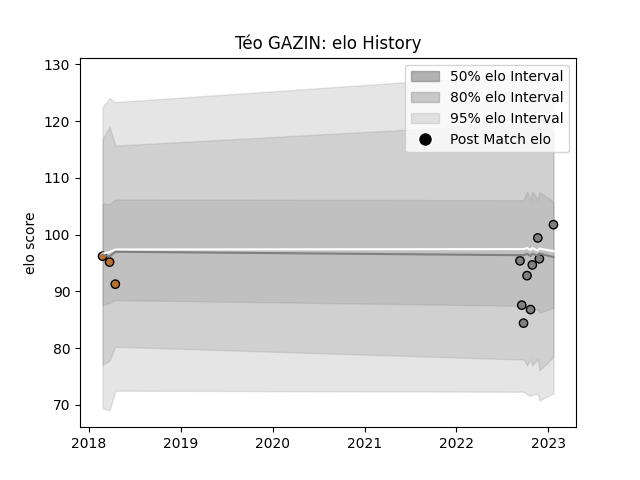

---  
layout: page  
title: Téo GAZIN  
date: 2023-01-31 10:55:16.167119  
categories: player  
---
# Téo GAZIN

## Positions: FL, N8

## Current elo: 101.0

## Current Percentile: 66.0

# Elo History

# Match History

| Team     |   Appearances |   Win Rate |
|:---------|--------------:|-----------:|
| Rennes   |            10 |        0.2 |
| Narbonne |             3 |        0.5 |

| Opponent                   |   Matches |   Win Rate |
|:---------------------------|----------:|-----------:|
| Tarbes                     |         2 |        0   |
| Valence Romans Drome Rugby |         2 |        0   |
| Albi                       |         1 |        0   |
| Bayonne                    |         1 |        1   |
| Blagnac                    |         1 |        0   |
| Carqueiranne-Hyères        |         1 |        1   |
| Cognac Saint Jean d'Angély |         1 |        1   |
| Grenoble                   |         1 |        0.5 |
| Narbonne                   |         1 |        0   |
| Nevers                     |         1 |        0   |
| US Bressane                |         1 |        0   |