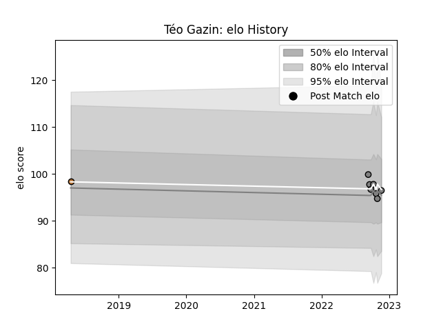

---  
layout: page  
title: Téo Gazin  
date: 2022-11-22 11:34:20.389191  
categories: player  
---
# Téo Gazin

## Positions: FL, N8

## Current elo: 96.0

## Current Percentile: 44.0

# Elo History

# Match History

| Team     |   Appearances |   Win Rate |
|:---------|--------------:|-----------:|
| Rennes   |             7 |   0.285714 |
| Narbonne |             1 |   1        |

| Opponent                   |   Matches |   Win Rate |
|:---------------------------|----------:|-----------:|
| Albi                       |         1 |          0 |
| Bayonne                    |         1 |          1 |
| Blagnac                    |         1 |          0 |
| Carqueiranne-Hyères        |         1 |          1 |
| Cognac Saint Jean d'Angély |         1 |          1 |
| Tarbes                     |         1 |          0 |
| US Bressane                |         1 |          0 |
| Valence Romans Drome Rugby |         1 |          0 |