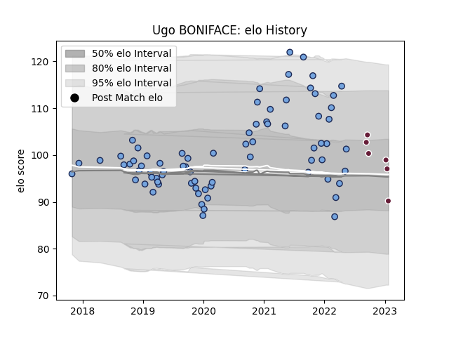

---  
layout: page  
title: Ugo BONIFACE  
date: 2023-01-31 10:54:50.161262  
categories: player  
---
# Ugo BONIFACE

## Positions: P

## Current elo: 90.0

## Current Percentile: 65.0

# Elo History

# Match History

| Team            |   Appearances |   Win Rate |
|:----------------|--------------:|-----------:|
| Bayonne         |            76 |   0.546053 |
| Bordeaux Begles |             6 |   0.333333 |

| Opponent             |   Matches |   Win Rate |
|:---------------------|----------:|-----------:|
| Montpellier Herault  |         5 |   0.4      |
| Montauban            |         4 |   1        |
| Narbonne             |         4 |   0.75     |
| Stade Toulousain     |         4 |   0.5      |
| Brive                |         4 |   0.375    |
| Colomiers            |         4 |   0.75     |
| Oyonnax              |         3 |   0.666667 |
| La Rochelle          |         3 |   0.333333 |
| Provence Rugby       |         3 |   0.333333 |
| Agen                 |         3 |   0.666667 |
| Castres Olympique    |         3 |   0.666667 |
| Carcassonne          |         3 |   0.333333 |
| Stade Francais Paris |         3 |   0.666667 |
| Beziers              |         3 |   0.666667 |
| Toulon               |         3 |   0.333333 |
| Soyaux-Angouleme     |         3 |   0.666667 |
| Rouen                |         2 |   1        |
| Pau                  |         2 |   0        |
| Mont-de-Marsan       |         2 |   0        |
| Aurillac             |         2 |   0.5      |
| Grenoble             |         2 |   0.5      |
| Clermont Auvergne    |         2 |   0.5      |
| Bordeaux Begles      |         2 |   0        |
| Bayonne              |         2 |   0.5      |
| Vannes               |         2 |   0.5      |
| Massy                |         1 |   1        |
| Nevers               |         1 |   1        |
| Lyon                 |         1 |   0        |
| London Irish         |         1 |   1        |
| Racing 92            |         1 |   1        |
| Gloucester Rugby     |         1 |   0        |
| Sharks               |         1 |   0        |
| Biarritz Olympique   |         1 |   0        |
| US Bressane          |         1 |   1        |