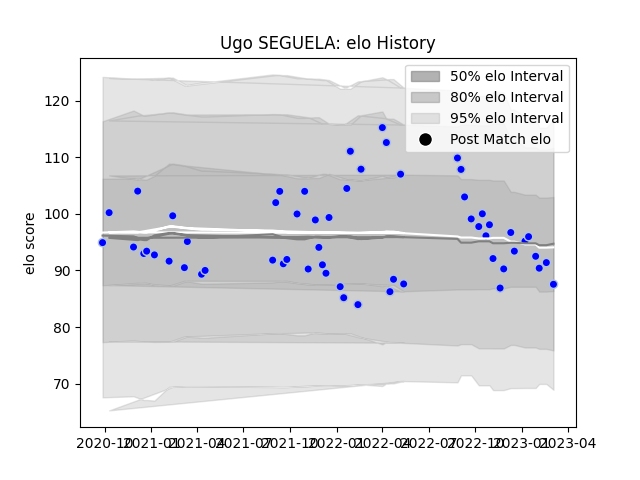

---  
layout: page  
title: Ugo SEGUELA  
date: 2023-01-17 11:37:19.731648  
categories: player  
---
# Ugo SEGUELA

## Positions: SH

## Current elo: 105.0

## Current Percentile: 73.0

# Elo History

# Match History

| Team      |   Appearances |   Win Rate |
|:----------|--------------:|-----------:|
| Colomiers |            53 |   0.603774 |

| Opponent                   |   Matches |   Win Rate |
|:---------------------------|----------:|-----------:|
| Vannes                     |         5 |   0.2      |
| Montauban                  |         5 |   0.4      |
| Rouen                      |         4 |   0.75     |
| Carcassonne                |         4 |   0.5      |
| Provence Rugby             |         4 |   0.75     |
| Mont-de-Marsan             |         4 |   0.5      |
| Nevers                     |         3 |   1        |
| Biarritz Olympique         |         3 |   0.333333 |
| Grenoble                   |         3 |   0.666667 |
| Oyonnax                    |         3 |   0.666667 |
| US Bressane                |         2 |   0.5      |
| Agen                       |         2 |   0.5      |
| Aurillac                   |         2 |   0.5      |
| Beziers                    |         2 |   0.5      |
| Narbonne                   |         2 |   1        |
| Perpignan                  |         1 |   1        |
| Massy                      |         1 |   1        |
| Soyaux-Angouleme           |         1 |   1        |
| Bayonne                    |         1 |   1        |
| Valence Romans Drome Rugby |         1 |   1        |