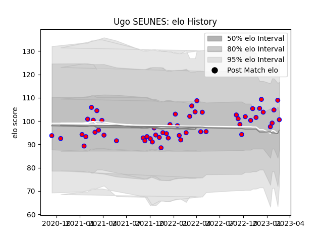

---  
layout: page  
title: Ugo SEUNES  
date: 2023-03-09 10:07:33.024155  
categories: player  
---
# Ugo SEUNES

## Positions: FH

## Current elo: 94.0

## Current Percentile: 57.0

# Elo History

# Match History

| Team    |   Appearances |   Win Rate |
|:--------|--------------:|-----------:|
| Blagnac |            56 |   0.553571 |

| Opponent                   |   Matches |   Win Rate |
|:---------------------------|----------:|-----------:|
| Albi                       |         5 |   0.4      |
| Tarbes                     |         5 |   0.7      |
| Dax                        |         4 |   0.75     |
| US Bressane                |         4 |   0.25     |
| Aubenas                    |         4 |   0.75     |
| Valence Romans Drome Rugby |         4 |   0.5      |
| Cognac Saint Jean d'Angély |         4 |   0.5      |
| Chambery                   |         4 |   0.75     |
| Bourgoin-Jallieu           |         4 |   0.5      |
| Dijon                      |         3 |   0.333333 |
| Narbonne                   |         3 |   0.166667 |
| Suresnes                   |         3 |   1        |
| Massy                      |         3 |   0.666667 |
| Nice                       |         2 |   0.5      |
| Soyaux-Angouleme           |         2 |   0        |
| Rennes                     |         1 |   1        |
| Carqueiranne-Hyères        |         1 |   1        |