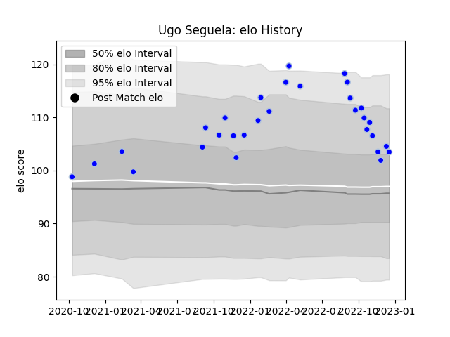

---  
layout: page  
title: Ugo Seguela  
date: 2022-12-18 16:17:10.082188  
categories: player  
---
# Ugo Seguela

## Positions: SH

## Current elo: 103.0

## Current Percentile: 77.0

# Elo History

# Match History

| Team      |   Appearances |   Win Rate |
|:----------|--------------:|-----------:|
| Colomiers |            30 |        0.6 |

| Opponent                   |   Matches |   Win Rate |
|:---------------------------|----------:|-----------:|
| Provence Rugby             |         3 |   0.666667 |
| Oyonnax                    |         3 |   0.666667 |
| Narbonne                   |         2 |   1        |
| Mont-de-Marsan             |         2 |   0        |
| Rouen                      |         2 |   0.5      |
| Nevers                     |         2 |   1        |
| Vannes                     |         2 |   0        |
| Grenoble                   |         2 |   1        |
| Carcassonne                |         2 |   0.5      |
| Beziers                    |         2 |   0.5      |
| Massy                      |         1 |   1        |
| Montauban                  |         1 |   0        |
| Bayonne                    |         1 |   1        |
| Biarritz Olympique         |         1 |   0        |
| Soyaux-Angouleme           |         1 |   1        |
| US Bressane                |         1 |   0        |
| Valence Romans Drome Rugby |         1 |   1        |
| Aurillac                   |         1 |   1        |