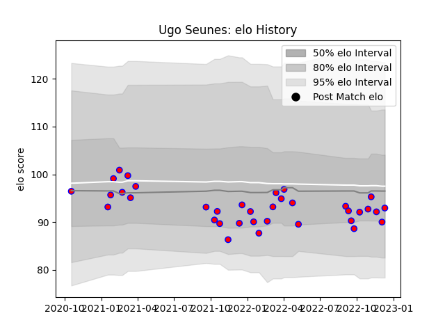

---  
layout: page  
title: Ugo Seunes  
date: 2022-11-22 11:47:52.364098  
categories: player  
---
# Ugo Seunes

## Positions: FH

## Current elo: 92.0

## Current Percentile: 46.0

# Elo History

# Match History

| Team    |   Appearances |   Win Rate |
|:--------|--------------:|-----------:|
| Blagnac |            34 |   0.514706 |

| Opponent                   |   Matches |   Win Rate |
|:---------------------------|----------:|-----------:|
| Albi                       |         4 |   0.5      |
| Chambery                   |         3 |   0.666667 |
| Dijon                      |         3 |   0.333333 |
| Narbonne                   |         3 |   0.166667 |
| Tarbes                     |         3 |   1        |
| Valence Romans Drome Rugby |         3 |   0.333333 |
| Aubenas                    |         2 |   1        |
| Cognac Saint Jean d'Angély |         2 |   0.5      |
| Dax                        |         2 |   0.5      |
| Suresnes                   |         2 |   1        |
| US Bressane                |         2 |   0        |
| Carqueiranne-Hyères        |         1 |   1        |
| Massy                      |         1 |   0        |
| Nice                       |         1 |   0        |
| Rennes                     |         1 |   1        |
| Soyaux-Angouleme           |         1 |   0        |