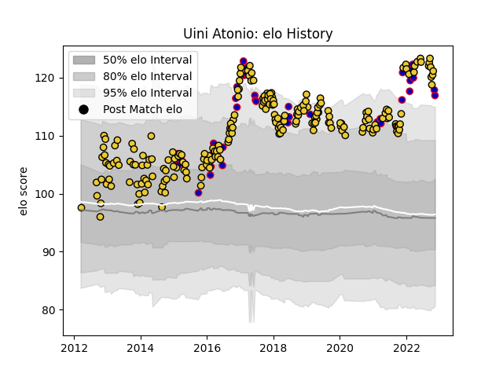

---  
layout: page  
title: Uini Atonio  
date: 2022-12-14 11:35:13.938596  
categories: player  
---
# Uini Atonio

## Positions: P

## Country: France

## Current elo: 117.0

## Current Percentile: 95.0

# Elo History

# Match History

| Team        |   Appearances |   Win Rate |
|:------------|--------------:|-----------:|
| La Rochelle |           224 |   0.604911 |
| France      |            40 |   0.525    |

| Opponent             |   Matches |   Win Rate |
|:---------------------|----------:|-----------:|
| Racing 92            |        16 |   0.5      |
| Stade Toulousain     |        15 |   0.266667 |
| Lyon                 |        14 |   0.75     |
| Montpellier Herault  |        14 |   0.535714 |
| Castres Olympique    |        14 |   0.571429 |
| Pau                  |        13 |   0.769231 |
| Toulon               |        12 |   0.625    |
| Clermont Auvergne    |        12 |   0.291667 |
| Bordeaux Begles      |        12 |   0.666667 |
| Stade Francais Paris |        10 |   0.45     |
| Brive                |         7 |   0.571429 |
| Agen                 |         7 |   0.714286 |
| Bayonne              |         7 |   0.571429 |
| Wales                |         6 |   0.5      |
| Ireland              |         5 |   0.6      |
| Oyonnax              |         5 |   0.5      |
| New Zealand          |         5 |   0.2      |
| Grenoble             |         5 |   0.8      |
| Scotland             |         5 |   0.6      |
| England              |         4 |   0.25     |
| Narbonne             |         4 |   0.5      |
| Tarbes               |         4 |   0.5      |
| Gloucester Rugby     |         4 |   0.25     |
| South Africa         |         4 |   0.25     |
| Albi                 |         4 |   0.75     |
| Aurillac             |         3 |   0.666667 |
| Bourgoin-Jallieu     |         3 |   0.833333 |
| Perpignan            |         3 |   1        |
| Italy                |         3 |   1        |
| Dax                  |         3 |   0.666667 |
| Beziers              |         3 |   1        |
| Australia            |         2 |   0.5      |
| Auch                 |         2 |   1        |
| Sale Sharks          |         2 |   1        |
| Argentina            |         2 |   0.5      |
| Ulster               |         2 |   0.5      |
| Wasps                |         2 |   0.5      |
| Bristol Rugby        |         2 |   1        |
| Zebre                |         2 |   1        |
| Provence Rugby       |         2 |   1        |
| Mont-de-Marsan       |         2 |   0.5      |
| Carcassonne          |         2 |   1        |
| Harlequins           |         2 |   1        |
| Benetton Treviso     |         2 |   1        |
| Scarlets             |         1 |   0        |
| Samoa                |         1 |   1        |
| Massy                |         1 |   1        |
| Japan                |         1 |   1        |
| Romania              |         1 |   1        |
| Georgia              |         1 |   1        |
| Exeter Chiefs        |         1 |   0        |
| US Bressane          |         1 |   1        |
| Connacht             |         1 |   0        |
| Biarritz Olympique   |         1 |   1        |
| Worcester Warriors   |         1 |   1        |
| Northampton Saints   |         1 |   1        |