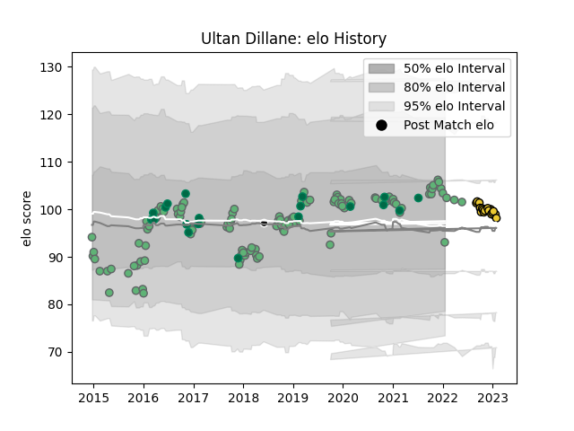

---  
layout: page  
title: Ultan Dillane  
date: 2022-12-09 13:23:23.737473  
categories: player  
---
# Ultan Dillane

## Positions: L

## Country: Ireland

## Current elo: 106.0

## Current Percentile: 80.0

# Elo History

# Match History

| Team        |   Appearances |   Win Rate |
|:------------|--------------:|-----------:|
| Connacht    |           115 |   0.517391 |
| Ireland     |            19 |   0.684211 |
| La Rochelle |            11 |   0.545455 |
| Barbarians  |             1 |   1        |

| Opponent             |   Matches |   Win Rate |
|:---------------------|----------:|-----------:|
| Ulster               |        15 |   0.4      |
| Munster              |        11 |   0.454545 |
| Leinster             |        10 |   0.3      |
| Glasgow Warriors     |         9 |   0.222222 |
| Ospreys              |         8 |   0.5      |
| Scarlets             |         7 |   0.285714 |
| Zebre                |         6 |   0.833333 |
| Cardiff Blues        |         6 |   0.5      |
| Benetton Treviso     |         5 |   1        |
| Stade Toulousain     |         4 |   0.25     |
| Brive                |         4 |   0.75     |
| Southern Kings       |         4 |   1        |
| Cheetahs             |         4 |   0.75     |
| Italy                |         4 |   1        |
| Dragons              |         4 |   0.75     |
| France               |         3 |   0.333333 |
| Gloucester Rugby     |         3 |   0.333333 |
| England              |         3 |   0.333333 |
| Edinburgh            |         3 |   0.333333 |
| Scotland             |         3 |   0.666667 |
| RC Enisei            |         2 |   1        |
| South Africa         |         2 |   0.5      |
| Wasps                |         2 |   0.5      |
| Montpellier Herault  |         2 |   1        |
| Sale Sharks          |         2 |   0.5      |
| Oyonnax              |         2 |   1        |
| Stade Francais Paris |         1 |   0        |
| Worcester Warriors   |         1 |   0.5      |
| Toulon               |         1 |   1        |
| Racing 92            |         1 |   1        |
| Australia            |         1 |   1        |
| Pau                  |         1 |   0        |
| Newcastle Falcons    |         1 |   1        |
| New Zealand          |         1 |   1        |
| Bayonne              |         1 |   0        |
| Leicester Tigers     |         1 |   0        |
| Japan                |         1 |   1        |
| Grenoble             |         1 |   0        |
| Fiji                 |         1 |   1        |
| Clermont Auvergne    |         1 |   0        |
| Castres Olympique    |         1 |   1        |
| Canada               |         1 |   1        |
| Bulls                |         1 |   1        |
| Lyon                 |         1 |   1        |