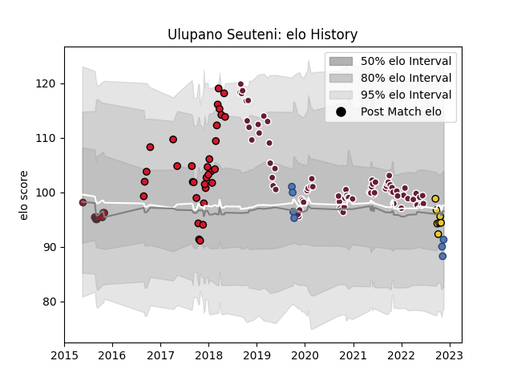

---  
layout: page  
title: Ulupano Seuteni  
date: 2022-11-16 11:25:55.661895  
categories: player  
---
# Ulupano Seuteni

## Positions: C, FH

## Country: Samoa

## Current elo: 90.0

## Current Percentile: 35.0

# Elo History

# Match History

| Team            |   Appearances |   Win Rate |
|:----------------|--------------:|-----------:|
| Bordeaux Begles |            73 |   0.589041 |
| Oyonnax         |            32 |   0.328125 |
| Toulon          |             8 |   0.375    |
| La Rochelle     |             7 |   0.428571 |
| Samoa           |             6 |   0.333333 |

| Opponent             |   Matches |   Win Rate |
|:---------------------|----------:|-----------:|
| Stade Toulousain     |        10 |   0.15     |
| Agen                 |         8 |   0.75     |
| Montpellier Herault  |         8 |   0.5625   |
| Lyon                 |         8 |   0.625    |
| Castres Olympique    |         8 |   0.5625   |
| Clermont Auvergne    |         7 |   0.642857 |
| Toulon               |         7 |   0.428571 |
| Racing 92            |         7 |   0.428571 |
| La Rochelle          |         7 |   0.357143 |
| Stade Francais Paris |         6 |   0.5      |
| Perpignan            |         6 |   0.75     |
| Pau                  |         5 |   0.4      |
| Brive                |         5 |   0.4      |
| Connacht             |         4 |   0        |
| Biarritz Olympique   |         3 |   0.333333 |
| Bayonne              |         3 |   0.666667 |
| Montauban            |         2 |   0.5      |
| Wasps                |         2 |   1        |
| Bordeaux Begles      |         2 |   0.5      |
| Worcester Warriors   |         2 |   0.5      |
| Grenoble             |         2 |   0.5      |
| Edinburgh            |         2 |   0.75     |
| Bristol Rugby        |         1 |   0        |
| Dax                  |         1 |   0        |
| Japan                |         1 |   0        |
| Italy                |         1 |   0        |
| Ireland              |         1 |   0        |
| Russia               |         1 |   1        |
| Scarlets             |         1 |   1        |
| Scotland             |         1 |   0        |
| Soyaux-Angouleme     |         1 |   1        |
| Georgia              |         1 |   1        |
| Beziers              |         1 |   0        |
| Oyonnax              |         1 |   1        |