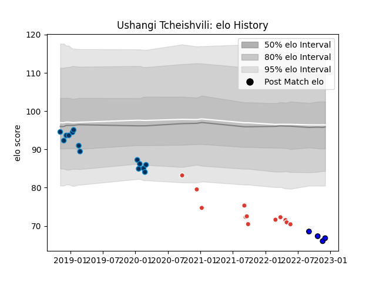

---  
layout: page  
title: Ushangi Tcheishvili  
date: 2022-11-22 11:42:55.645876  
categories: player  
---
# Ushangi Tcheishvili

## Positions: P

## Current elo: 66.0

## Current Percentile: 1.0

# Elo History

# Match History

| Team                |   Appearances |   Win Rate |
|:--------------------|--------------:|-----------:|
| Montpellier Herault |            14 |   0.285714 |
| Biarritz Olympique  |            12 |   0.291667 |
| Massy               |             3 |   0        |

| Opponent                   |   Matches |   Win Rate |
|:---------------------------|----------:|-----------:|
| Racing 92                  |         3 |   0.333333 |
| Stade Toulousain           |         2 |   0        |
| Perpignan                  |         2 |   0        |
| La Rochelle                |         2 |   0        |
| Agen                       |         1 |   1        |
| Mont-de-Marsan             |         1 |   0.5      |
| Valence Romans Drome Rugby |         1 |   0        |
| Toulon                     |         1 |   0        |
| Pau                        |         1 |   0        |
| Oyonnax                    |         1 |   0        |
| Newcastle Falcons          |         1 |   1        |
| Montpellier Herault        |         1 |   0        |
| Lyon                       |         1 |   0        |
| Bayonne                    |         1 |   1        |
| Grenoble                   |         1 |   0        |
| Gloucester Rugby           |         1 |   0        |
| Edinburgh                  |         1 |   0        |
| Connacht                   |         1 |   1        |
| Clermont Auvergne          |         1 |   0        |
| Castres Olympique          |         1 |   0        |
| Bordeaux Begles            |         1 |   1        |
| Biarritz Olympique         |         1 |   0        |
| Beziers                    |         1 |   1        |
| Vannes                     |         1 |   0        |