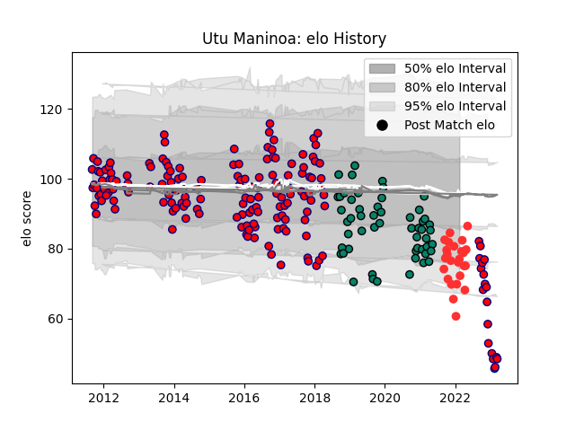

---  
layout: page  
title: Utu Maninoa  
date: 2023-01-17 11:33:38.414577  
categories: player  
---
# Utu Maninoa

## Positions: N8, L

## Current elo: 82.0

## Current Percentile: 9.0

# Elo History

# Match History

| Team                       |   Appearances |   Win Rate |
|:---------------------------|--------------:|-----------:|
| Aurillac                   |           152 |   0.496711 |
| Montauban                  |            54 |   0.444444 |
| Tarbes                     |            25 |   0.46     |
| Cognac Saint Jean d'Angély |            14 |   0        |

| Opponent                   |   Matches |   Win Rate |
|:---------------------------|----------:|-----------:|
| Beziers                    |        16 |   0.3125   |
| Carcassonne                |        15 |   0.533333 |
| Mont-de-Marsan             |        15 |   0.466667 |
| Dax                        |        15 |   0.466667 |
| Albi                       |        11 |   0.545455 |
| Narbonne                   |        11 |   0.454545 |
| Colomiers                  |        11 |   0.363636 |
| Bourgoin-Jallieu           |        11 |   0.545455 |
| Tarbes                     |         9 |   0.555556 |
| Soyaux-Angouleme           |         9 |   0.5      |
| Massy                      |         8 |   0.625    |
| Provence Rugby             |         8 |   0.4375   |
| Biarritz Olympique         |         8 |   0.625    |
| Perpignan                  |         7 |   0.571429 |
| Oyonnax                    |         7 |   0.285714 |
| Bayonne                    |         6 |   0.166667 |
| Montauban                  |         6 |   0.75     |
| Vannes                     |         6 |   0.5      |
| Pau                        |         5 |   0        |
| Valence Romans Drome Rugby |         5 |   0.4      |
| Nevers                     |         4 |   0.5      |
| US Bressane                |         4 |   0.5      |
| Agen                       |         4 |   0.5      |
| La Rochelle                |         4 |   0.25     |
| Grenoble                   |         4 |   0.5      |
| Auch                       |         4 |   0.5      |
| Aurillac                   |         4 |   0.75     |
| Suresnes                   |         3 |   0        |
| Blagnac                    |         3 |   0        |
| Lyon                       |         3 |   0        |
| Chambery                   |         3 |   0.333333 |
| Périgueux                  |         2 |   0.5      |
| Rouen                      |         2 |   1        |
| Cognac Saint Jean d'Angély |         2 |   1        |
| Nice                       |         2 |   0        |
| Dijon                      |         2 |   0.75     |
| Aubenas                    |         2 |   0.5      |
| Brive                      |         1 |   0        |
| Carqueiranne-Hyères        |         1 |   0        |
| Roval Drome XV             |         1 |   1        |
| Rennes                     |         1 |   0        |