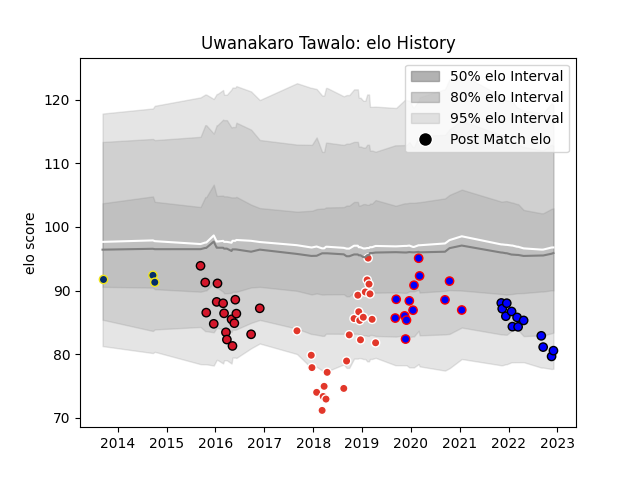

---  
layout: page  
title: Uwanakaro Tawalo  
date: 2022-12-12 14:49:30.234316  
categories: player  
---
# Uwanakaro Tawalo

## Positions: W

## Current elo: 81.0

## Current Percentile: 6.0

# Elo History

# Match History

| Team               |   Appearances |   Win Rate |
|:-------------------|--------------:|-----------:|
| Biarritz Olympique |            25 |   0.44     |
| Oyonnax            |            17 |   0.294118 |
| Beziers            |            13 |   0.461538 |
| Massy              |            13 |   0.538462 |
| Clermont Auvergne  |             3 |   0.333333 |

| Opponent                   |   Matches |   Win Rate |
|:---------------------------|----------:|-----------:|
| Aurillac                   |         5 |   0.6      |
| Soyaux-Angouleme           |         5 |   0.6      |
| Vannes                     |         4 |   0.25     |
| Nevers                     |         4 |   0.25     |
| Colomiers                  |         3 |   0        |
| Provence Rugby             |         3 |   0.666667 |
| Agen                       |         3 |   0.333333 |
| Mont-de-Marsan             |         3 |   0.666667 |
| Nice                       |         2 |   0.5      |
| US Bressane                |         2 |   0.5      |
| Suresnes                   |         2 |   1        |
| Stade Toulousain           |         2 |   0.5      |
| Stade Francais Paris       |         2 |   0        |
| Beziers                    |         2 |   0.5      |
| Oyonnax                    |         2 |   0.5      |
| Carcassonne                |         2 |   0.5      |
| Castres Olympique          |         2 |   0        |
| Bordeaux Begles            |         2 |   0        |
| Grenoble                   |         1 |   0        |
| Roval Drome XV             |         1 |   1        |
| Valence Romans Drome Rugby |         1 |   1        |
| Ulster                     |         1 |   0        |
| Toulon                     |         1 |   0        |
| Clermont Auvergne          |         1 |   0        |
| Cognac Saint Jean d'Angély |         1 |   1        |
| Bayonne                    |         1 |   1        |
| Saracens                   |         1 |   0        |
| Racing 92                  |         1 |   0        |
| La Rochelle                |         1 |   1        |
| Perpignan                  |         1 |   0        |
| Pau                        |         1 |   0        |
| Brive                      |         1 |   0        |
| Dax                        |         1 |   0        |
| Biarritz Olympique         |         1 |   0        |
| Montauban                  |         1 |   1        |
| Aubenas                    |         1 |   1        |
| Massy                      |         1 |   0        |
| Lyon                       |         1 |   1        |
| Bourgoin-Jallieu           |         1 |   1        |