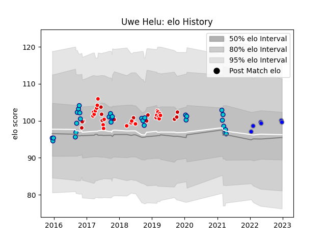

---  
layout: page  
title: Uwe Helu  
date: 2023-01-13 11:37:36.808729  
categories: player  
---
# Uwe Helu

## Positions: L, FL

## Country: Japan

## Current elo: 112.0

## Current Percentile: 83.0

# Elo History

# Match History

| Team                              |   Appearances |   Win Rate |
|:----------------------------------|--------------:|-----------:|
| Shizuoka Blue Revs                |            30 |   0.733333 |
| Sunwolves                         |            22 |   0.318182 |
| Japan                             |            14 |   0.357143 |
| Kubota Spears Funabashi Tokyo-Bay |             7 |   0.785714 |

| Opponent                          |   Matches |   Win Rate |
|:----------------------------------|----------:|-----------:|
| Yokohama Canon Eagles             |         7 |   0.785714 |
| Black Rams Tokyo                  |         4 |   0.75     |
| Saitama Wild Knights              |         4 |   0.25     |
| Urayasu D-Rocks                   |         4 |   1        |
| Kobelco Kobe Steelers             |         4 |   0        |
| Bulls                             |         3 |   0.666667 |
| Chiefs                            |         3 |   0.333333 |
| Stormers                          |         3 |   0.333333 |
| Italy                             |         2 |   0.5      |
| New South Wales Waratahs          |         2 |   0.5      |
| NTT Docomo Red Hurricanes Osaka   |         2 |   1        |
| Lions                             |         2 |   0        |
| Kubota Spears Funabashi Tokyo-Bay |         2 |   1        |
| Ireland                           |         2 |   0        |
| Toshiba Brave Lupus Tokyo         |         2 |   1        |
| Green Rockets Tokatsu             |         2 |   1        |
| Blues                             |         2 |   0.5      |
| Queensland Reds                   |         2 |   0.5      |
| Romania                           |         1 |   1        |
| South Africa                      |         1 |   0        |
| Tokyo Sungoliath                  |         1 |   1        |
| Sharks                            |         1 |   0        |
| Scotland                          |         1 |   1        |
| Samoa                             |         1 |   1        |
| Toyota Verblitz                   |         1 |   1        |
| Wales                             |         1 |   0        |
| Argentina                         |         1 |   0        |
| New Zealand                       |         1 |   0        |
| Munakata Sanix Blues              |         1 |   1        |
| Mie Honda Heat                    |         1 |   1        |
| Australia                         |         1 |   0        |
| Jaguares                          |         1 |   0        |
| Hino Red Dolphins                 |         1 |   1        |
| Highlanders                       |         1 |   0        |
| Hanazono Kintetsu Liners          |         1 |   1        |
| Georgia                           |         1 |   1        |
| England                           |         1 |   0        |
| Cheetahs                          |         1 |   0        |
| Melbourne Rebels                  |         1 |   0        |