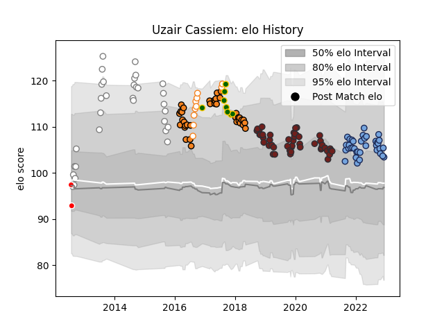

---  
layout: page  
title: Uzair Cassiem  
date: 2022-12-09 13:15:18.512541  
categories: player  
---
# Uzair Cassiem

## Positions: N8, FL

## Country: South Africa

## Current elo: 105.0

## Current Percentile: 74.0

# Elo History

# Match History

| Team                |   Appearances |   Win Rate |
|:--------------------|--------------:|-----------:|
| Scarlets            |            46 |   0.543478 |
| Cheetahs            |            37 |   0.351351 |
| Bayonne             |            35 |   0.642857 |
| Pumas               |            31 |   0.677419 |
| Free State Cheetahs |            10 |   1        |
| South Africa        |             8 |   0.375    |
| Valke               |             2 |   0        |

| Opponent                 |   Matches |   Win Rate |
|:-------------------------|----------:|-----------:|
| Southern Kings           |         8 |   1        |
| Natal Sharks             |         6 |   0.666667 |
| Eastern Province Kings   |         6 |   0.75     |
| Edinburgh                |         6 |   0.166667 |
| Cardiff Blues            |         6 |   0.5      |
| Benetton Treviso         |         5 |   0.6      |
| Connacht                 |         5 |   0.8      |
| Bulls                    |         4 |   0.25     |
| Ulster                   |         4 |   0.25     |
| Boland Cavaliers         |         4 |   1        |
| Munster                  |         4 |   0.25     |
| Griquas                  |         4 |   0.5      |
| Golden Lions             |         4 |   0.25     |
| Free State Cheetahs      |         3 |   0.833333 |
| Leopards                 |         3 |   0.666667 |
| Ospreys                  |         3 |   0.666667 |
| Stormers                 |         3 |   0        |
| Sunwolves                |         3 |   1        |
| Toulon                   |         3 |   0        |
| Dragons                  |         3 |   0.333333 |
| Zebre                    |         3 |   1        |
| Agen                     |         2 |   0.75     |
| Australia                |         2 |   0.5      |
| Oyonnax                  |         2 |   0.5      |
| Rouen                    |         2 |   1        |
| Colomiers                |         2 |   0.5      |
| SWD Eagles               |         2 |   1        |
| Blue Bulls               |         2 |   0.5      |
| Mont-de-Marsan           |         2 |   0        |
| London Irish             |         2 |   1        |
| Lions                    |         2 |   0        |
| Argentina                |         2 |   1        |
| Bayonne                  |         2 |   1        |
| Beziers                  |         2 |   0.5      |
| Pumas                    |         2 |   0.5      |
| Glasgow Warriors         |         2 |   0        |
| Valke                    |         2 |   1        |
| Cheetahs                 |         2 |   1        |
| Vannes                   |         2 |   1        |
| Wales                    |         2 |   0        |
| Griffons                 |         2 |   1        |
| Grenoble                 |         2 |   0.5      |
| Aurillac                 |         2 |   1        |
| Western Province         |         2 |   1        |
| Carcassonne              |         2 |   0.5      |
| Queensland Reds          |         1 |   0        |
| Racing 92                |         1 |   1        |
| US Bressane              |         1 |   1        |
| Scarlets                 |         1 |   0        |
| Sharks                   |         1 |   0        |
| Stade Francais Paris     |         1 |   0        |
| Stade Toulousain         |         1 |   1        |
| Provence Rugby           |         1 |   1        |
| Western Force            |         1 |   1        |
| Crusaders                |         1 |   0        |
| Perpignan                |         1 |   1        |
| Leicester Tigers         |         1 |   0        |
| Castres Olympique        |         1 |   0        |
| Brumbies                 |         1 |   0        |
| Brive                    |         1 |   0        |
| Highlanders              |         1 |   0        |
| Hurricanes               |         1 |   0        |
| Ireland                  |         1 |   0        |
| Jaguares                 |         1 |   0        |
| La Rochelle              |         1 |   1        |
| Leinster                 |         1 |   0        |
| Blues                    |         1 |   0        |
| Lyon                     |         1 |   1        |
| Melbourne Rebels         |         1 |   0        |
| Montauban                |         1 |   1        |
| Montpellier Herault      |         1 |   0        |
| Border Bulldogs          |         1 |   1        |
| Bordeaux Begles          |         1 |   1        |
| New South Wales Waratahs |         1 |   0        |
| New Zealand              |         1 |   0        |
| Nevers                   |         1 |   1        |