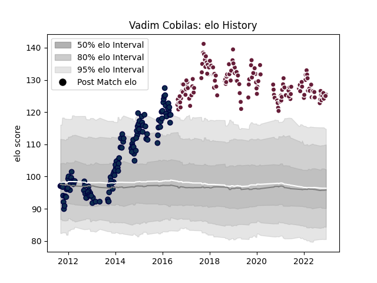

---  
layout: page  
title: Vadim Cobilas  
date: 2022-11-15 23:42:14.649343  
categories: player  
---
# Vadim Cobilas

## Positions: P

## Current elo: 120.0

## Current Percentile: 98.0

# Elo History

# Match History

| Team            |   Appearances |   Win Rate |
|:----------------|--------------:|-----------:|
| Bordeaux Begles |           143 |   0.566434 |
| Sale Sharks     |           129 |   0.472868 |

| Opponent             |   Matches |   Win Rate |
|:---------------------|----------:|-----------:|
| Clermont Auvergne    |        14 |   0.571429 |
| Montpellier Herault  |        14 |   0.321429 |
| Castres Olympique    |        13 |   0.615385 |
| Toulon               |        12 |   0.416667 |
| Stade Toulousain     |        12 |   0.25     |
| Saracens             |        12 |   0.208333 |
| Racing 92            |        12 |   0.583333 |
| Pau                  |        12 |   0.583333 |
| Newcastle Falcons    |        11 |   0.5      |
| London Irish         |        10 |   0.6      |
| Lyon                 |        10 |   0.6      |
| Leicester Tigers     |        10 |   0.2      |
| La Rochelle          |         9 |   0.444444 |
| Wasps                |         9 |   0.777778 |
| Stade Francais Paris |         9 |   0.666667 |
| Worcester Warriors   |         9 |   0.666667 |
| Harlequins           |         9 |   0.222222 |
| Gloucester Rugby     |         9 |   0.444444 |
| Exeter Chiefs        |         9 |   0.333333 |
| Brive                |         8 |   0.5625   |
| Northampton Saints   |         8 |   0.5      |
| Agen                 |         8 |   0.875    |
| Bath Rugby           |         8 |   0.625    |
| Oyonnax              |         4 |   0.5      |
| Perpignan            |         4 |   0.75     |
| Bayonne              |         4 |   0.75     |
| Biarritz Olympique   |         3 |   1        |
| Scarlets             |         3 |   1        |
| London Welsh         |         3 |   0.666667 |
| Cardiff Blues        |         2 |   0.5      |
| Grenoble             |         2 |   1        |
| Ulster               |         2 |   1        |
| Edinburgh            |         2 |   1        |
| Dragons              |         1 |   1        |
| Munster              |         1 |   0        |
| La Vila              |         1 |   1        |
| Bristol Rugby        |         1 |   0        |
| Ospreys              |         1 |   0        |
| Connacht             |         1 |   0        |